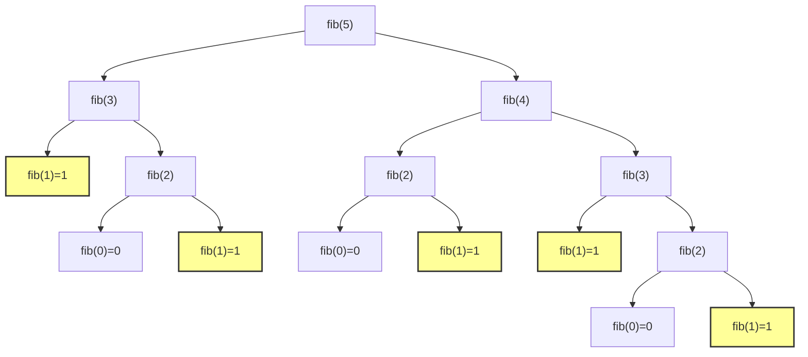

### Example: Counting Partitions
Definition: the number of ways n is able to be parts up to size m, where m < n for always. ex. (n = 3, m = 2)  -> {1++, 1+2}
- in another word, given m is the largest number you can use, how many combination can you have to use to sum up to the number given n
- Use recursive decomposition: finding simpler instances of the number
    - ex count_partitions(6, 4)
        - Group 4: 1+1, 4; 2, 4
        - Group 3: 1+1+1, 3; 1+2, 3; 3+3
        - Group 2: 2,2,2; 1+1, 2, 2; 1+1+1+1, 2
        - Group 1: 1,1,1,1,1,1
    - one can use the groups/partitions to decompose the amount of calulcuation you do 
        - explore two possibilities
            - at least 4 or not using at least 4
            - with_m: count_partition(2, 4), without_m: count_partition(6, 3)
                - note: count_partitions(6 - 4, 4), count_partition(6, 4 -1)
                - note: you partition with_m of one side with m and the another side with all the rest combination (1+1, 4;2, 4)
                - note: you partition without the m by having the count partition m - 1 with a reducing combination and the n with a reducing combination
                (3,3;, 2+1,3;1+1+1,3;2+2,2;1+1+2,2; 1+1+1+1,2;1+1+1+1+1,1)
```python
def count_partitions(n, m):
    if n == 0:
        return 1
    elif n < 0:
        return 0
    elif m == 0:
        return 0
    else:
        with_m = count_partitions(n - m, m) # partition remaining after using m; [2], [1, 1]
        without_m = count_partitions(n, m - 1) # partition smaller than m
        return with_m + without_m
'''
count_partitions(2, 4):
   # with_m: trying to use 4 
   count_partitions(-2, 4)  # n<0, returns 0
   
   # without_m: not using 4, try up to 3
   count_partitions(2, 3):
       # with_m: trying to use 3
       count_partitions(-1, 3)  # n<0, returns 0
       
       # without_m: not using 3, try up to 2  
       count_partitions(2, 2):
           # with_m: trying to use 2
           count_partitions(0, 2)  # n=0, returns 1 -> [2]
           
           # without_m: not using 2, try up to 1
           count_partitions(2, 1):
               # with_m: trying to use 1  
               count_partitions(1, 1):
                   # with_m: trying to use 1
                   count_partitions(0, 1)  # n=0, returns 1 -> [1,1]
                   # without_m: can't use 0
                   count_partitions(1, 0)  # m=0, returns 0
note: without_m will be entered whenever the base case have been met with m subtracted by 1
'''
```


### Tree Recursion
- When a function makes more than one recursive call
```python
from ucb import trace # visualize with the tree
def fib(n):
    if n == 0:
        return 0
    elif n == 1:
        return 1
    else:
         return fib(n-2) + fib(n-1)
# highly inefficient, because results could be reached within multiple branches, yet some of them are shorter than the another
```

### Example: Inverse Cascade ?
```python
# the high-level abstraction of what we want
def inverse_cascade(n = 1234):
    grow(n) 
    print(n) # print(1234)
    shrink(n)
    # shrink(n) calls the lambda function where f = print(n), g = shrink(n), given n // 10; in essenes, it should have 
    # 12, 123 in order of the return value, where we invert back from the buttom, making it a return of 12 ,123


# the actual implementation of inverse_cascade
def f_then_g(f, g, n):
    if n:
        f(n)
        g(n)
grow = lambda n: f_then_g(grow, print, n //10)
# grow(n) calls the lambda function where f = grow (n), g = print(n), given n // 10; in essnes, it should have 
# 123, 12, 1 in order of the return value, where we invert back from the buttom, making it a return of 1 , 12 ,123
shrink = lambda n: f_then_g(print, shrink, n//10)
# shrink(n) calls the lambda function where f = print(n), g = shrink(n), given  n // 10;  in essence, it should have 123, 12, 1 printed

# this level of abstraction is very cool yet mind boggling
```

### Order of Recusrive Calls
```python
def cascade(n):
    if n < 10:
        print(n)
    else:
        print(n)
        cascade(n//10)
        print(n) # print the n stored at the cascade frame
# output: 
123
12
1
12
123
#

'''
global frame: cascade(n)
cascade frame: n= 123
print(123) # no reuturn None, b/c we are only reaching the n// 10 part
cascade frame: n= 12
print(12)   # no return None, b/c we are only reaching the n // 10 part
print(1), return None
print(12) - cascade(n = 12) removed, return None
print(123) - cascade(n = 123) removed, return None; global frame cascade points to cascade(n) function
'''

# shorter equivalent
def cascade(n):
    print(n)
    if n > 10:
        cascade(n//10)
        print(n)
'''
print(123)- casade( n: 123 )
print(12) - cascade(n:123 // 10 = 12)
print(1)
print(cascade(n:12)) # now remove the cascade(n = 12)
print(cascade(n:123)) # now remove the cascade(n = 123)
'''
```
