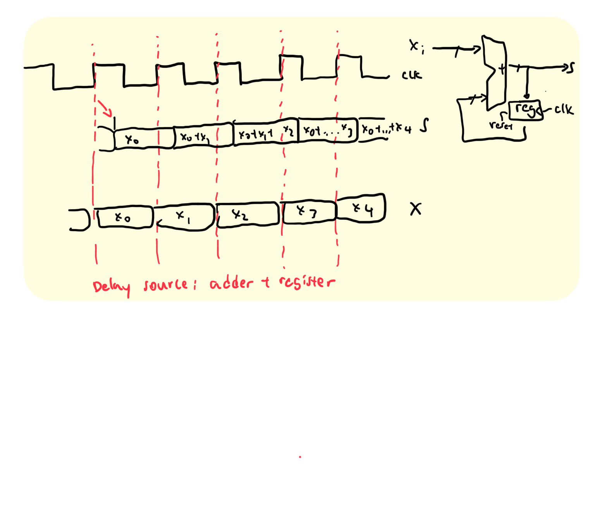
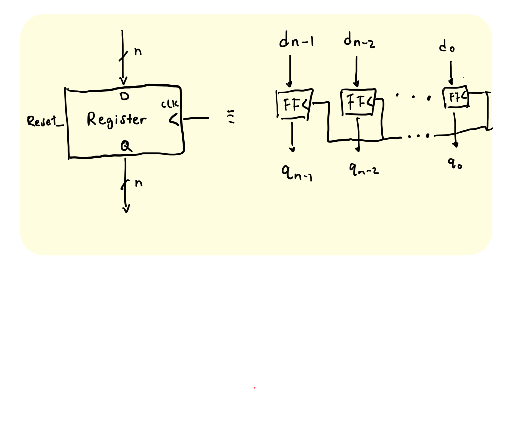
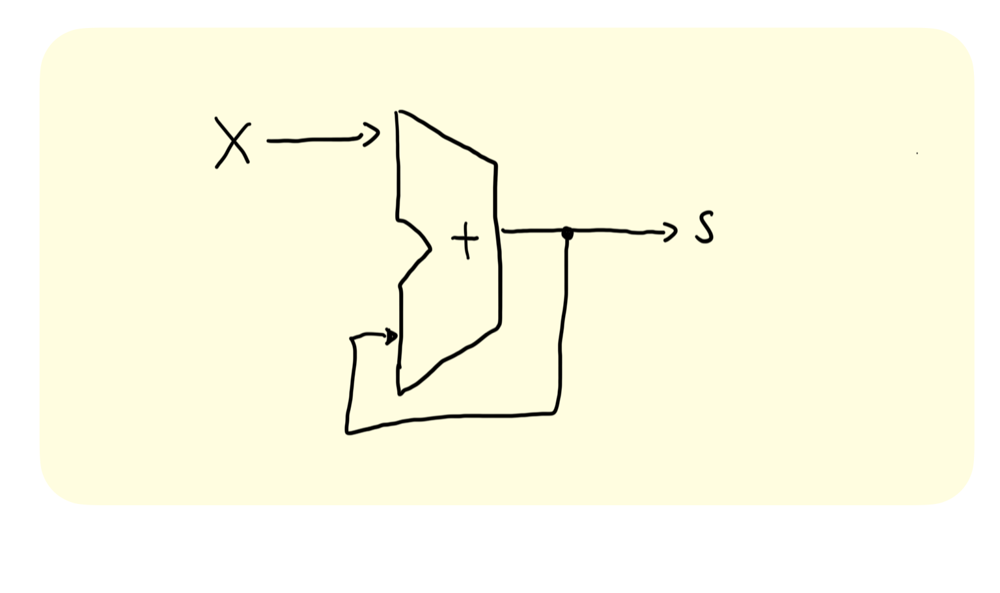

### Timing Control
- Delay: #<time>
	- Delays by a specific amount of simulation time
	- Can do calculations in <time>
	- Examples: #(PERIOD/4), #50 
- Edge-sensitive: @(<pos/negedge> signal)
	- Delays next statement until specified transition on signal
	- Example: @(posedge CLK)
- Level-sensitive Event: wait (<expression>)
	- Delays next statement until <expression> evaluates to TRUE
	- Example: wait(enable == 1)


### System Verilog Coding Guidelines
1. When modeling sequential logic, use nonblocking assignments
2. When modeling combinational logic with an always_comb block, use 
blocking assignments
3. When modeling both sequential and combinational logic within the same always_ff block, use nonblocking assignments
4. Do not mix blocking and nonblocking assignments in the same always_* 
block
5. Do not make assignments to the same variable from more than one 
always_* block


### Blocking vs. Non blocking
- Blocking statement (=): statement effects evaluated sequentially
	- - Resembles programming languages
- Non-blocking statement (<=): statement effects evaluated 'in parallel'
	- resembles hardware


### Procedural Blocks
- Always: loop to execute over and over again
	- Block gets triggered by a sensitivity list
	- Any object that is assigned a value in an always statement must be declared as a variable (logic or reg)
		- ex. always @ (posedge clk)
- always_ff: special SystemVerilog for Sl
	- It signals the intent of using a flip-flop
		- ex. always_ff @ (posedge clk)
### Verilog: Basic D Flip-Flop, Register
```systemverilog
module basic_D_FF (q, d, clk); 
	output logic q; // q is state-holding 
	input logic d, clk; 
	
	always_ff @(posedge clk) 
	q <= d; // use <= for clocked elements 
endmodule


module basic_reg (q, d, clk); 
	output logic [7:0] q; 
	input logic [7:0] d; 
	input logic clk; 
	
	always_ff @(posedge clk) 
	q <= d; 
endmodule
```
### Flip-Flop Timing Terminology 
- Camera Analogy: non-blurry digital photo
	- Don’t move while camera shutter is opening
	- Don’t move while camera shutter is closing 
	- Check for blurriness once image appears on the display
- Sequential logic elements
	- **Setup Time**: how long the input must be stable before the CLK trigger for proper input read
	- **Hold Time**: how long the input must be stable after the CLK trigger for proper input read
	- **“CLK-to-Q” Delay**: how long it takes the output to change, measured from the CLK trigger
### State Element: Register
- n instances of flip-flops together
	- One for every bit in input/output bus width
- Output Q resets to zero when Reset signal is high during clock trigger
	- Some extra circuitry required for this

<!-- -->


### State Element: Flip-Flop
- Positive edge-triggered D-type flipflop
	- On the rising edge of the clock, input d is sampled and transferred to the output q
	- At all other times, the input d is ignored and the previously sampled value is retained

<!-- -->


### Accumulator Example
- An example of why we would need to control the flow of information

$X_i -/-> [Accumulator] -/-> S$
Want:
```
S = 0;
for (i = 0;i<n; i++)
	S = S + X_i
```

First Attempt

<!-- -->

- This does not work: it does not consider when S = 0 and there is no control on the for loop itself
