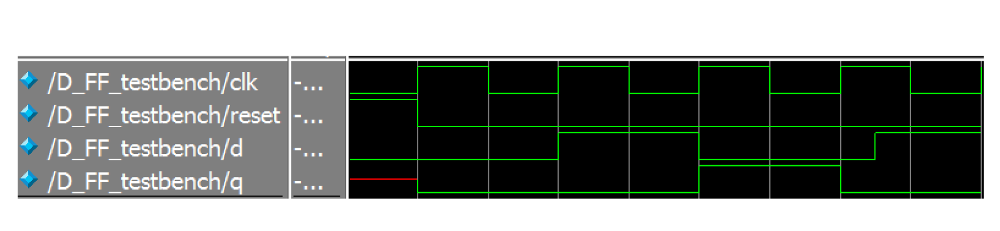
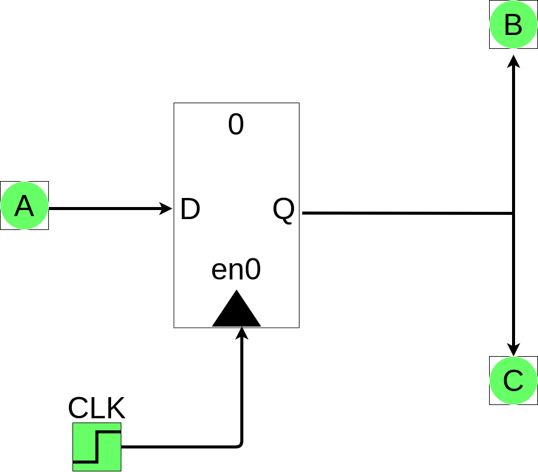
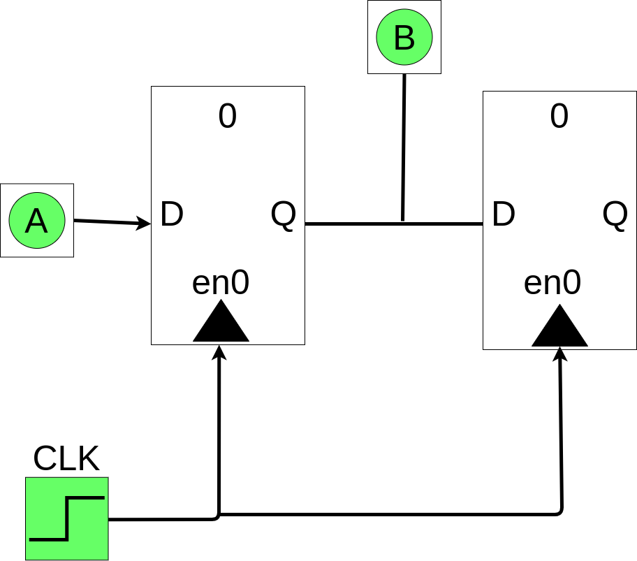
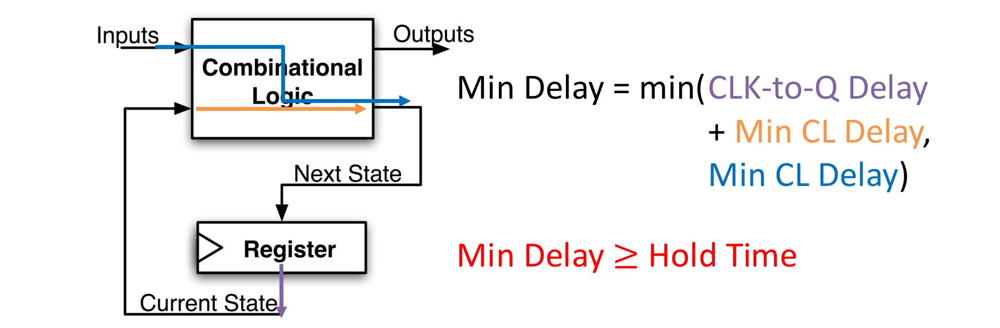
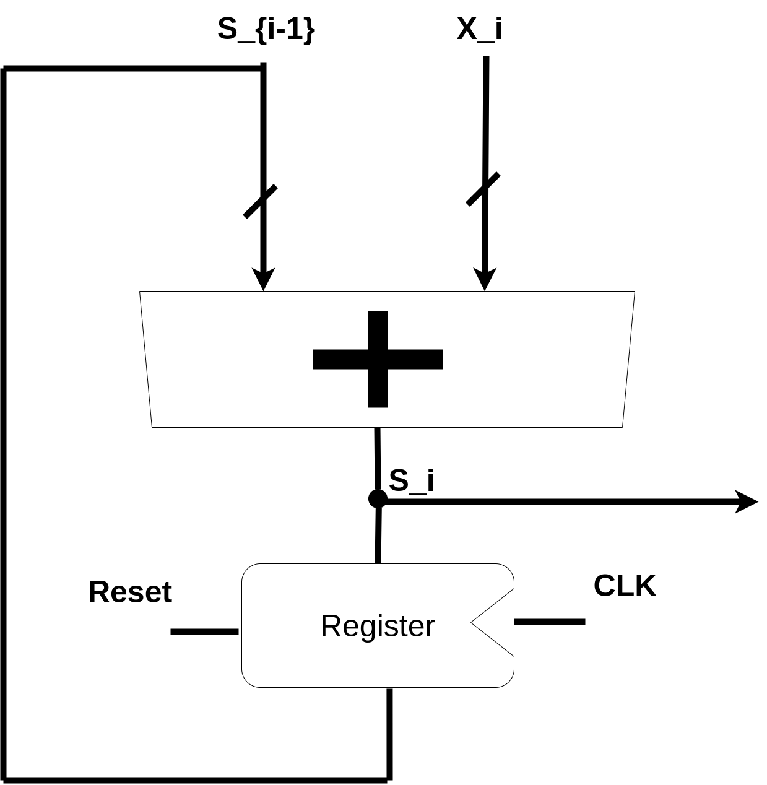
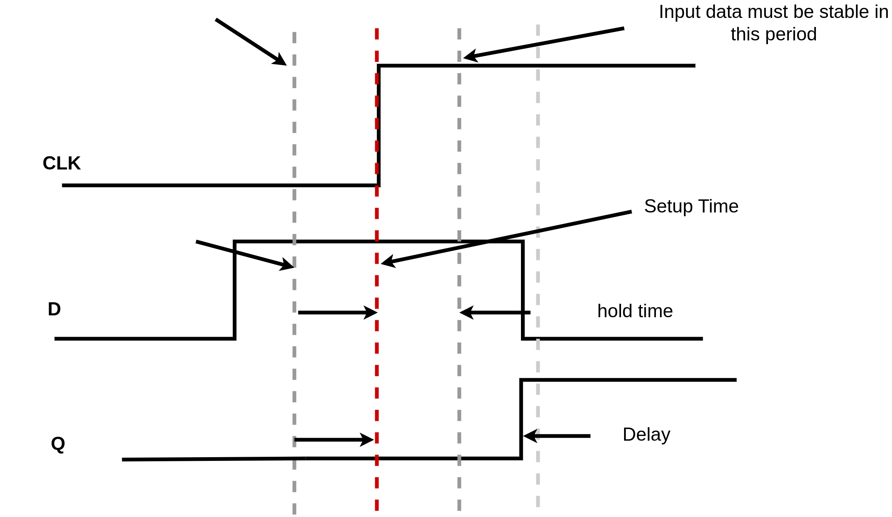
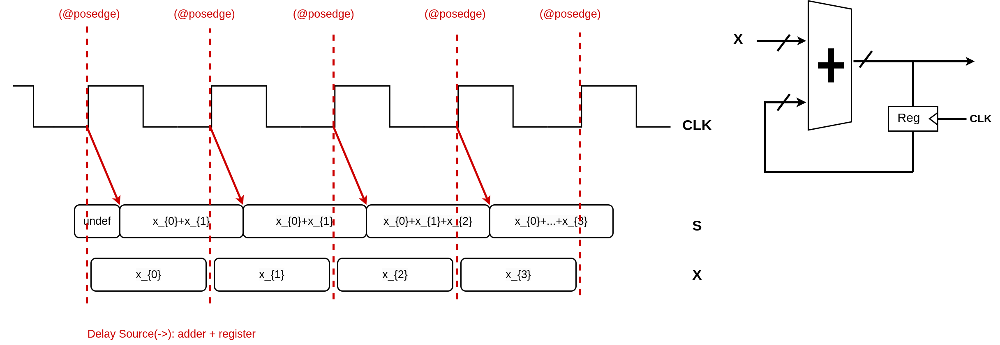
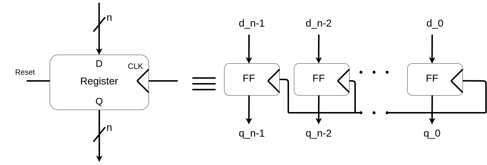
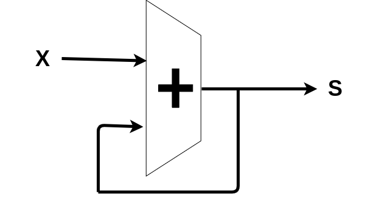

### Timing Control
- Delay: #<time>
	- Delays by a specific amount of simulation time
	- Can do calculations in <time>
	- Examples: #(PERIOD/4), #50 
- Edge-sensitive: @(<pos/negedge> signal)
	- Delays next statement until specified transition on signal
	- Example: @(posedge CLK)
- Level-sensitive Event: wait (<expression>)
	- Delays next statement until <expression> evaluates to TRUE
	- Example: wait(enable == 1)


### System Verilog Coding Guidelines
1. When modeling sequential logic, use nonblocking assignments
2. When modeling combinational logic with an always_comb block, use 
blocking assignments
3. When modeling both sequential and combinational logic within the same always_ff block, use nonblocking assignments
4. Do not mix blocking and nonblocking assignments in the same always_* 
block
5. Do not make assignments to the same variable from more than one 
always_* block

### Verilog testbench with Clock
```systemverilog
module D_FF_testbench;
	logic CLK, reset, d;
	logic q;
	parameter PERIOD = 100;
	D_FF dut (.q, .d, .reset, .CLK); // Instantiate the D_FF

	initial 
		CLK <= 0;
	always 
		#(PERIOD/2) CLK<= ~CLK; // Set up clock

	initial begin // Set up signals
			d <= 0; reset <= 1;
		@(posedge CLK);
			reset <= 0;
		@(posedge CLK); d <= 1;
		@(posedge CLK); d <= 0;
		@(posedge CLK); #(PERIOD/4) d <= 1;
		@(posedge CLK);
	$stop();// end the simulation
	end
endmodule
```


note: recall that q samples the value of d at positive edge with some delay

### Verilog: Simulated Clock
For simulation, you need to generate a clock signal:
	- For entirety of simulation/program, so use always block
```
// Explicit edges
initial
	clk = 0;
always begin
	#50 clk <= 1;
	#50 clk <= 0;
end

// Toggled form
initial
	clk = 0;
always
	#50 clk <= ~clk;

// Toggled form and with a defined period
parameter period = 100;
initial
	clk = 0;
always
	#(period/2) clk <= ~clk;


```
### Verilog: Reset Functionality
Option 1: synchronous reset
```systemverilog
module D_FF1 (q, d, reset, clk);
	output logic q; // q is state-holding
	input logic d, reset, clk;
	always_ff @(posedge clk or posedge reset)
		if (reset)
			q <= 0; // on reset, set to 0
		else
			q <= d; // otherwise pass d to q
endmodule
```

Option 2: asynchronous reset
```systemverilog
module D_FF1 (q, d, reset, clk);
	output logic q; // q is state-holding
	input logic d, reset, clk;
	always_ff @(posedge clk or posedge reset)
	if (reset)
		q <= 0;// on reset, set to 0
	else
		q <= d;// otherwise pass d to q
endmodule
```

### Blocking vs. Non blocking
- Blocking statement (=): statement effects evaluated sequentially
	- - Resembles programming languages
- Non-blocking statement (<=): statement effects evaluated 'in parallel'
	- resembles hardware

Nonblocking:



Blocking:



### Procedural Blocks
- Always: loop to execute over and over again
	- Block gets triggered by a sensitivity list
	- Any object that is assigned a value in an always statement must be declared as a variable (logic or reg)
		- ex. always @ (posedge clk)
- always_ff: special SystemVerilog for Sl
	- It signals the intent of using a flip-flop
		- ex. always_ff @ (posedge clk)
### Verilog: Basic D Flip-Flop, Register
```systemverilog
module basic_D_FF (q, d, clk); 
	output logic q; // q is state-holding 
	input logic d, clk; 
	
	always_ff @(posedge clk) 
	q <= d; // use <= for clocked elements 
endmodule


module basic_reg (q, d, clk); 
	output logic [7:0] q; 
	input logic [7:0] d; 
	input logic clk; 
	
	always_ff @(posedge clk) 
	q <= d; 
endmodule
```
The difference between D-flip flop and register
- D flipflop is a single bit storage unit

- Register is the multiple flipfloper together, a multiple bit storage unit

### Critical Path
- The critical path is the longest delay between any two registers in a
circuit (Reg - CL - CL - CL - Reg)
- The clock period must be longer than this critical path, or the signal will
not propagate properly to that next register


### Minimum Delay
If shortest path to register input is too short, might violate t_{hold}
constraint
- Input could change before state is “locked in”
- Particularly problematic with asynchronous signals

### When can Input Change

When Can the Input Change?
- When a register input changes shouldn’t violate hold time (t_{hold}) or
setup time (t_{setup}) constraints within a clock period (t_{period})

- Let t_{input,i} be the time it takes for the input of a register to change for
the i-th time in a single clock cycle, measured from the CLK trigger:
	- Then we need t_{hold}  <= t_{input, i} <= t_{period} - t_{setup} for all i
	- Two separate constraints


- What is the max frequency of this circuit?
	- Limited by how much time needed to get correct Next State to Register
(t_setup constraint)
	- max_{frequency} = 1/ min{period}

### Model for Synchronous Digital Systems
Combinational logic blocks separated by registers
- Clock signal connects only to sequential logic elements
- Feedback is optional depending on application

Questions:
- How do we ensure proper behavior?
- How fast can we run our clock?

### Accumulator: Proper Timing
Reset signal shown

- X_i and S_{i-1} arrive at adder at different times
	- S_i  becomes “wrong” temporarily but corrects before
	register captures its value (before the next clock signal)
- Avoid input instability around rising edge of CLK



### FlipFlop Timing Behavior


### Flip-Flop Timing Terminology 
- Camera Analogy: non-blurry digital photo
	- Don’t move while camera shutter is opening
	- Don’t move while camera shutter is closing 
	- Check for blurriness once image appears on the display
- Sequential logic elements
	- **Setup Time**: how long the input must be stable before the CLK trigger for proper input read
	- **Hold Time**: how long the input must be stable after the CLK trigger for proper input read
	- **“CLK-to-Q” Delay**: how long it takes the output to change, measured from the CLK trigger
### State Element: Register
- n instances of flip-flops together
	- One for every bit in input/output bus width
- Output Q resets to zero when Reset signal is high during clock trigger
	- Some extra circuitry required for this
	




### State Element: Flip-Flop
- Positive edge-triggered D-type flipflop
	- On the rising edge of the clock, input d is sampled and transferred to the output q
	- At all other times, the input d is ignored and the previously sampled value is retained




### Accumulator Example
- An example of why we would need to control the flow of information

$X_i -/-> [Accumulator] -/-> S$
Want:
```
S = 0;
for (i = 0;i<n; i++)
	S = S + X_i
```

First Attempt



- This does not work: it does not consider when S = 0 and there is no control on the for loop itself
