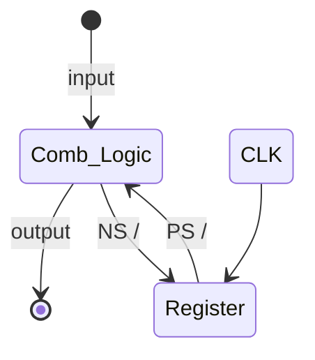
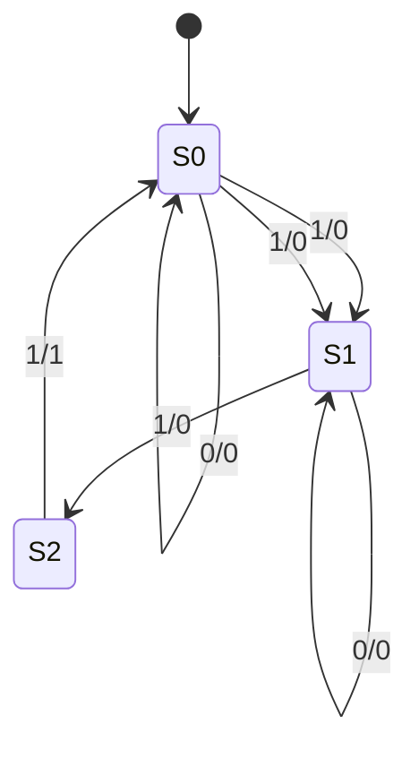
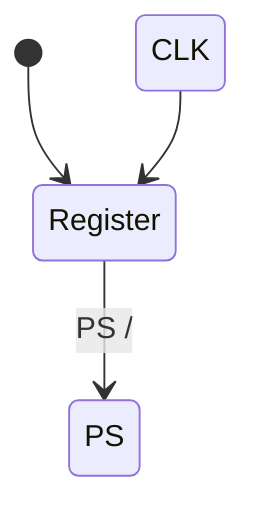
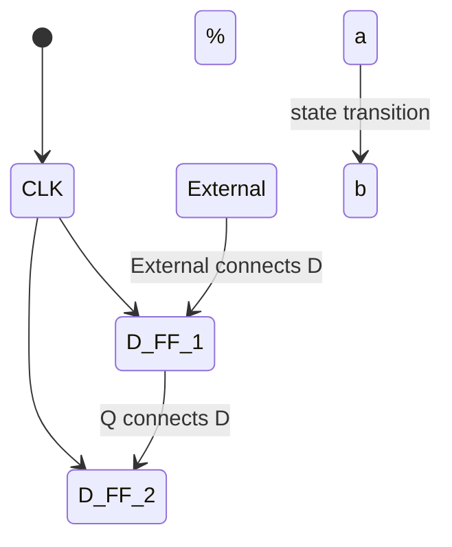

### Summary
Gating the clock and external inputs can cause timing issues and 
metastability

FSMs visualize state-based computations
- Implementations use registers for the state (PS) and combinational logic to 
compute the next state and output(s)
- Mealy machines have outputs based on state transitions

FSMs in Verilog usually have separate blocks for state updates and CL
- Blocking assignments in CL, non-blocking assignments in SL
- Testbenches need to be carefully designed to test all state transitions

### Testbench Waveform
to be filled

### FSM Test Bench 
```systemverilog
module simpleFSM_tb ();
  logic clk, reset, w;
  wire out;

  // Instantiate device under test
  simpleFSM dut (.clk(clk), .reset(reset), .w(w), .out(out));

  // Generate simulated clock
  parameter CLOCK_PERIOD = 100;
  initial begin
    clk = 0;
    forever #(CLOCK_PERIOD / 2) clk = ~clk;
  end

  // Generate test vectors
  initial begin
    // Reset the FSM
    reset = 1; w = 0;
    @(posedge clk); // Wait for 1 clock cycle
    reset = 0;

    // 4 cycles of 0 input
    repeat (4) @(posedge clk);

    // Input sequence
    w = 1; @(posedge clk);
    w = 0; @(posedge clk);
    w = 1; @(posedge clk);
    repeat (4) @(posedge clk); // 4 cycles of input

    // Input sequence continues
    w = 0; @(posedge clk);
    @(posedge clk); // Extra cycle

    $stop; // Pause the simulation
  end
endmodule
```


### One or Two Blocks?
We showed the state update in two separate blocks:
- always_comb block that calculates the next state (ns)
- always_ff block that defines the register (ps updates to last ns on clock 
trigger)
- Can this be done with a single block?
- If so, which one:  always_comb  or  always_ff

Two Blocks:
```systemverilog
// Output logic
  assign out = (ns == S11);
  // Next State Logic (ns)
  always_comb
    case (ps)
      S0:  if (w) ns = S1;
           else   ns = S0;
      S1:  if (w) ns = S11;
           else   ns = S0;
      S11: if (w) ns = S11;
           else   ns = S0;
    endcase
// State Update Logic (ps)
 always_ff @(posedge clk)
   if (reset)
    ps <= S0;
   else
    ps <= ns;
```

One Block:
```systemverilog
always_ff @(posedge clk)
  if (reset)
    ps <= S0;
  else
    case (ps)
      S0:  if (w) ps <= S1;
           else   ps <= S0;
      S1:  if (w) ps <= S11;
           else   ps <= S0;
      S11: if (w) ps <= S11;
           else   ps <= S0;
    endcase
```


### Reminder: Blokcing vs. Non-blocking
- Never mix in one always block
- Each variable writte in only one always block
Blocking (=) in CL:
```systemverilog
// Output logic
  assign out = (ns == S11);
  // Next State Logic (ns)
  always_comb
    case (ps)
      S0:  if (w) ns = S1;
           else   ns = S0;
      S1:  if (w) ns = S11;
           else   ns = S0;
      S11: if (w) ns = S11;
           else   ns = S0;
    endcase
```
Non-blocking(<=) in SL:
```systemverilog
// State Update Logic (ps)
 always_ff @(posedge clk)
   if (reset)
    ps <= S0;
   else
    ps <= ns;
```

### FSM in Verilog: Example
Arbitrary 3-state FSM that outputs 1 when two consecutive 1’s are seen 
on the input
- 2-bit state ps (00, 02, 20)
- clk and reset inputs
- 1-bit input w
- 1-bit output out
```verilog
module simpleFSM (clk, reset, w, out);
  input  logic clk, reset, w;
  output logic out;

  // State Encodings and Variables
  // (ps = Present State, ns = Next State)
  enum logic [1:0] {S0 = 2'b00, S1 = 2'b01, S11 = 2'b10} ps, ns;

  // Next State Logic (ns)
  always_comb begin
    case (ps)
      S0: 
        if (w) 
          ns = S1;
        else 
          ns = S0;
      S1: 
        if (w) 
          ns = S11;
        else 
          ns = S0;
      S11: 
        if (w) 
          ns = S11;
        else 
          ns = S0;
    endcase
  end

  // Output Logic – Could have been in "always" block
  // or part of Next State Logic.
  assign out = (ns == S11);

  // State Update Logic (ps)
  always_ff @(posedge clk or posedge reset) begin
    if (reset)
      ps <= S0;
    else
      ps <= ns;
  end

endmodule
```

### FSMs in Verilg Overview
FSMs follow a very particular organizational structure:


They can be implemented using the following design pattern:
1. Define states and state variables
2. Next state logic (ns)
3. Output logic
4. State update logic (ps)

### Vending Machine Implementation
to be filled
### Vending Machine State Table
to be filled
### Vending Machine Example
to be filled
### State Diagram Properties
to be filled
### FSM: Implementation
to be filled
### FSM Logic Simplification

to be filled

### FSM: Implementation
$NS_{1} = PS_0 \cdot In$
$NS_0 = \overline{PS_1} \cdot \overline{PS_0} \cdot In$
$Out = PS_1 \cdot In$

To test your FSM, take every transition you care about

### FSM: Combinational Logic vs. Truth Table
| PS   | In | NS   | Out |
|------|----|------|-----|
| 00   | 0  | 00   |  0  |
| 00   | 1  | 01   |  0  |
|------|----|------|-----|
| 01   | 0  | 01   |  0  |
| 01   | 1  | 10   |  0  |
|------|----|------|-----|
| 10   | 0  | 00   |  0  |
| 10   | 1  | 00   |  1  |
- notice how only when 1/0 is at at the S0 with an activated input (aka.1) you could get into a cascade of S0 -> S1 (ip:1/ op:0) -> S2 (ip:1/op:1) -> S0




### Hardware Implementation of FSM
Register holds a representation of the FSM’s state
- a unique bit pattern will need assign for each state
- outpu is the present//current state
- input is next state
<<<<<<< HEAD
#TODO: add comb implementation mermaid diagram
=======


>>>>>>> 22c5f69b4a470efd7f0fa966a9f33a4d5d11eba9

 Add

 ```mermaid
stateDiagram
    [*] --> Comb_Logic: input
    PS--> Comb_Logic:PS/ 
    Comb_Logic--> [*]: output
    Comb_Logic--> NS :NS/
```
Gets us


### Example: Buggy 3 Ones FSM
States: S0, S1, S2

Initial State: S0

Tansitions of form: input / output

This FSM detect 3 consecutive 1's in the input

Walkthrough: S0 (ip:1/0) -> S1 (ip:1/ op:0) -> S2 (ip:1/op:1) -> S0

## State Diagrams

A state diagram (in this class) is defined by:
- A set of states s (circles)
- An initial state s_0  (only arrow not between states)
- A transition function that maps from the current input and current state to the output and the next state (arrows between states)
- Note: We cover Mealy machines here; Moore machines put outputs on states, not transitions


State transitions are controlled by the clock
- On each clock cycle the machine checks the input and generate a new state and new output


### Finite State Machines (FSMs)
- they are just like state transition diagram for cs students
- In CSE 369: you implement FSM in hardware as synchrionus digital systems
- FF/registers hold "state"
- Controlller (state update, I/O) implmeneted in combinagtional logic

### Flip-Flop Realities: Metastability
**Metastability**L the ability of a digital system to persist for an unbounded time in an unstable equilibrium or metastable state
- Circuit may be unable to settle into a stable '0' or '1' logic level within the time required for proper circuit operation
- Unpredictable behavior or random value



