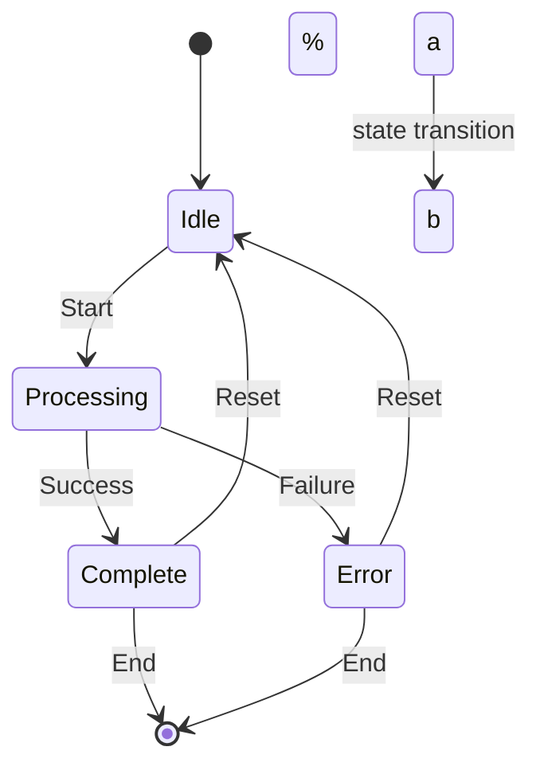

```mermaid

stateDiagram-v2
    [*] --> Idle
    Idle --> Processing: Start
    Processing --> Complete: Success
    Processing --> Error: Failure
    Complete --> Idle: Reset
    Error --> Idle: Reset
    Complete --> [*]: End
    Error --> [*]: End

%% [*] is your initial state at the beginning and end at the last line
%% --> gets you a pointer
%% strucutre of your state diagram
    % a --> b : state transition
```