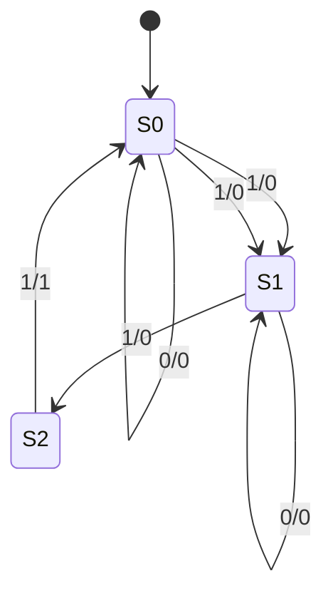
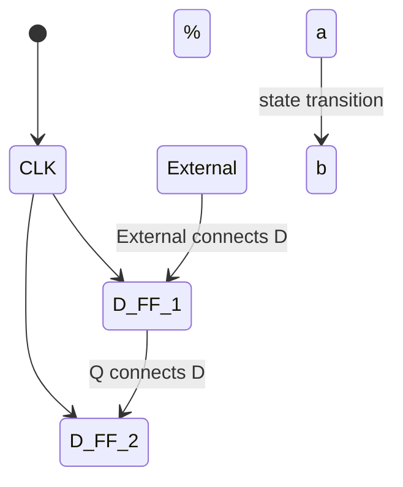

### FSMs in Verilg
FSMs follow a very particular organizational structure:


They can be implemented using the following design pattern:
1. Define states and state variables
2. Next state logic (ns)
3. Output logic
4. State update logic (ps)

### FSM: Implementation
$NS_{1} = PS_0 \cdot In$
$NS_0 = \overline{PS_1} \cdot \overline{PS_0} \cdot In$
$Out = PS_1 \cdot In$

To test your FSM, take every transition you care about

### FSM: Combinational Logic vs. Truth Table
| PS   | In | NS   | Out |
|------|----|------|-----|
| 00   | 0  | 00   |  0  |
|      | 1  | 01   |  0  |
|------|----|------|-----|
| 01   | 0  | 01   |  0  |
|      | 1  | 10   |  0  |
|------|----|------|-----|
| 10   | 0  | 00   |  0  |
|      | 1  | 00   |  1  |




### Hardware Implementation of FSM
Register holds a representation of the FSM’s state
- a unique bit pattern will need assign for each state
- outpu is the present//current state
- input is next state
#TODO: add comb implementation mermaid diagram
```mermaid


```
### Example: Buggy 3 Ones FSM
States: S0, S1, S2
Initial State: S0
Tansitions of form: input / output

This FSM detect 3 consecutive 1's in the input


## State Diagrams

A state diagram (in this class) is defined by:
- A set of states s (circles)
- An initial state s_0  (only arrow not between states)
- A transition function that maps from the current input and current state to the output and the next state (arrows between states)
- Note: We cover Mealy machines here; Moore machines put outputs on states, not transitions


State transitions are controlled by the clock
- On each clock cycle the machine checks the input and generate a new state and new output


### Finite State Machines (FSMs)
- they are just like state transition diagram for cs students
- In CSE 369: you implement FSM in hardware as synchrionus digital systems
- FF/registers hold "state"
- Controlller (state update, I/O) implmeneted in combinagtional logic

### Flip-Flop Realities: Metastability
**Metastability**L the ability of a digital system to persist for an unbounded time in an unstable equilibrium or metastable state
- Circuit may be unable to settle into a stable '0' or '1' logic level within the time required for proper circuit operation
- Unpredictable behavior or random value



