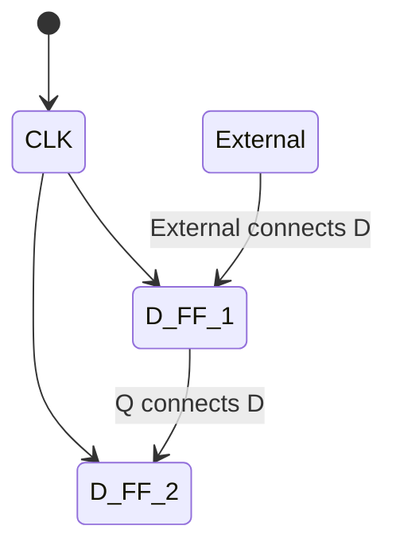
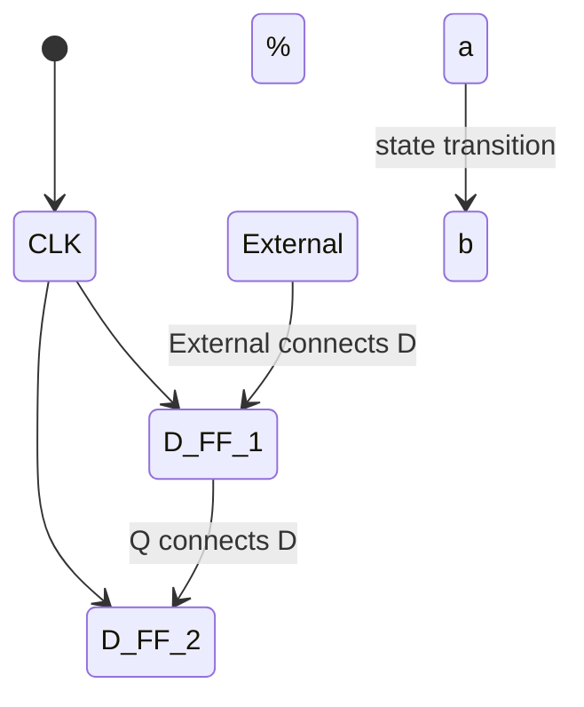

### Example: Buggy 3 Ones FSM
States: s0, s1, s2
Initial State: s0
Tansitions of form: input/ output

## State Diagrams

A state diagram (in this class) is defined by:
- A set of states s (circles)
- An initial state s_0  (only arrow not between states)
- A transition function that maps from the current input and current state to the output and the next state (arrows between states)
- Note: We cover Mealy machines here; Moore machines put outputs on states, not transitions

State transitions are controlled by the clock
- On each clock cycle the machine checks the input and generate a new state and new output

### Finite State Machines (FSMs)
- they are just like state transition diagram for cs students
- In CSE 369: you implement FSM in hardware as synchrionus digital systems
- FF/registers hold "state"
- Controlller (state update, I/O) implmeneted in combinagtional logic

### Flip-Flop Realities: Metastability
**Metastability**L the ability of a digital system to persist for an unbounded time in an unstable equilibrium or metastable state
- Circuit may be unable to settle into a stable '0' or '1' logic level within the time required for proper circuit operation
- Unpredictable behavior or random value

