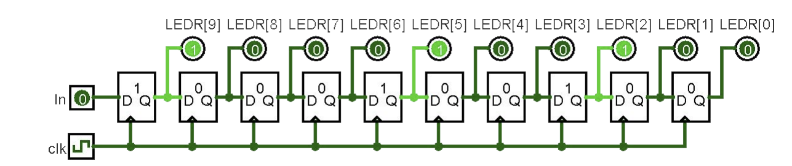

## Sec 5 (vend15.sv, vend15_tb.sv, light_game.sv)
### Exercise 3
Create a test bench for vend15 and simulate it in ModelSim
```systemverilog
module vend15_tb ();
  // signal declaration and dut instantiation
  logic clk, reset, N, D, Q, Open;
  vend15 dut (.*);

  // clock generation
  parameter T = 100;
  initial
    clk = 1'b0;
  always begin
    #(T/2)  clk <= 1'b0;
    #(T/2)  clk <= 1'b1;
  end

  initial begin
    {reset,N,D,Q} <= 4'b1000; @(posedge clk);  // reset
    {reset,N,D,Q} <= 4'b0000; @(posedge clk);  // Zero (1)
          {N,D,Q} <= 3'b001;  @(posedge clk);  // Zero (2)
          {N,D,Q} <= 3'b100;  @(posedge clk);  // Zero (3)
          {N,D,Q} <= 3'b001;  @(posedge clk);  // Five (4)
          {N,D,Q} <= 3'b100;  @(posedge clk);  // Zero (5)
          {N,D,Q} <= 3'b000;  @(posedge clk);  // Five (6)
          {N,D,Q} <= 3'b010;  @(posedge clk);  // Five (7)
          {N,D,Q} <= 3'b100;  @(posedge clk);  // Zero (8)
                              @(posedge clk);  // Five (9)
          {N,D,Q} <= 3'b001;  @(posedge clk);  // Ten  (10)
          {N,D,Q} <= 3'b010;  @(posedge clk);  // Zero (11)
                              @(posedge clk);  // Ten  (12)
                              @(posedge clk);  // Zero (13)
          {N,D,Q} <= 3'b100;  @(posedge clk);  // Ten  (14)
          {N,D,Q} <= 3'b010;  @(posedge clk);  // Zero (15)
          {N,D,Q} <= 3'b000;  @(posedge clk);  // Ten  (16)
                              @(posedge clk);  // extra
    $stop;
  end
endmodule  // vend15_tb

// note: we use 15 combination of inputs to test all transitions; there are other number of combinations however
```
### FSM Test Bench Example


```systemverilog
initial begin
    reset <= 1; w <= 0; @(posedge clk);  // reset
    reset <= 0;         @(posedge clk);  // remove reset -> curr state: S0
                w <= 1; @(posedge clk);  // curr state: S0, next state: S1
                w <= 0; @(posedge clk);  // curr state: S1, next state: S0
                w <= 1; @(posedge clk);  // curr state: S0, next state: S1
                        @(posedge clk);  // curr state: S1, next state: S11
                        @(posedge clk);  // curr state: S11, next state: S11
                        @(posedge clk);  // curr state: S11, next state: S11
                w <= 0; @(posedge clk);  // curr state: S11, next state: S0
                        @(posedge clk);  // curr state: S0 (extra cycle to see the final state, given all states have been visited)
    $stop;  // pause the simulation
end
```
### FSM Test Bench Notes
All notes from sequential test bencehs from section 4 still apply
- Generate a simulated clock (don’t use clock_divider), start with a reset and define all inputs at t=0, add extra delay at end to see the effects of your last 
input changes.
- To thoroughly test your FSM, need to take every transition that we care about (can omit/ignore don’t cares).
- Recommended test bench lines in initial block:
<input changes> @(posedge clk);  // current state: ???
- In ModelSim, you should at least add ps to waveforms .
- Could also include ns or other signals involved in ps/ns computations.

### Exercise 2
Below is an FSM for a modified vending machine with increased cost of 15 ¢ for gumballs that also accepting quarters (Q: 25¢dollar ); it still does not give change and can only take one coin at a time


```systemverilog
module vend15 (
  input  logic clk, reset,
  input  logic N, D, Q,   // nickel, dime, quarter
  output logic Open
);

  // Encoding: Zero=00, Five=10, Ten=11
  enum logic [1:0] {Zero, Five=2'b10, Ten=2'b11} ps, ns;

  // Next-state logic
  always_comb
  begin
    case (ps)

      Zero: 
        case ({N, D, Q})
          3'b000: ns = Zero; // no coin: stay
          3'b100: ns = Five; // nickel
          3'b010: ns = Ten;  // dime
          3'b001: ns = Zero; // quarter
          default: ns = ps;  // any other combo
        endcase


      Five: 
        case ({N, D, Q})
          3'b000: ns = Five; // no coin: stay
          3'b010: ns = Zero; // dime -> vend -> go to 0¢
          3'b001: ns = Zero; // quarter -> vend -> go to 0¢
          3'b100: ns = Ten;  // nickel -> 10¢
          default: ns = ps;
        endcase


      Ten:
        case ({N, D, Q})
          3'b000: ns = Ten;  // no coin: stay
          3'b100: ns = Zero; // nickel -> vend -> back to 0¢
          3'b010: ns = Zero; // dime   -> vend -> back to 0¢
          3'b001: ns = Zero; // quarter-> vend -> back to 0¢
          default: ns = ps;
        endcase

      default: 
        ns = ps;
    endcase
  end

  assign Open = Q | ((ps != Zero) & D) | ((ps == Ten) & N); // 15 being the vend condition

  // State register; asynchronous reset, whenever it is pressed -- interval of clk, which gives us the immediate result
  always_ff @(posedge clk or posedge reset) begin 
    if (reset)
      ps <= Zero;
    else
      ps <= ns;
  end

endmodule
```

### Exercise 1
The following FSM represents a Red Light, Green Light game, where a 
player is only allowed to move forward (M=1) when the light is green (L=1). Here, the player wins (output W=1) after successfully moving twice; moving when the light is red (L=0) results in returning to the start


```systemverilog

module light_game (input logic clk, reset, M, L, output logic W);
    enum logic [1:0] { Start = 2'b00, Mid = 2'b01, Win = 2'b10} ps, ns; // [1:0] ensures two bits assignment

    always_comb
        case (ps)
            Start: ns = (L & M) ? Mid : Start;
            Mid:   ns = (L & M) ? Win : (M ? Start : Mid);
            Win:   ns = M ? Start : Win;
        endcase

    assign W = (ns == Win);  // alt: ((ps == Mid) & L & M) | ((ps == Win) & ~M)

    always_ff @(posedge clk)
        if (reset)
            ps <= Start;
        else
            ps <= ns;

endmodule  // light_game

```


### FSM Design Pattern
1.  // State Encodings and Variables
    a. enum to define ps and ns
2.  // Next State Logic (ns)
    a. always_comb or assign with blocking assignments (=)
3.  // Output Logic
    a. assign or always_comb with blocking assignments (=)
    b. Mealy-type output example:  assign out = (ps == S1) & in;
4.  // State Update Logic (ps) - including reset
    a. always_ff with non-blocking assignments (<=)

### Finite State Machine Implementation
Module design notes:
-  Must have a clock input (e.g., clk, clock, 
CLOCK_50) for sequential elements.
- Should have a reset input (e.g., rst, reset) for 
“initialization.”
- Must have a present state (ps); recommended to also have a next state (ns).
### New SystemVerilog Commands
- enum - create an enumerated type with a restricted set of named values
    - basic usage: enum <original type> {<name_list>} <vars>;
    - <original type> must be wide enough to support the lenght of <name_list>; if omitted, default to int type
    - By default, names in the <name_list> are assigned consecutive values starting from 0
        - can explicitly assign values using name = <value> syntax
- example: enum logic [1:0] {S0, S1, S11 = 2'b11} ps , ns;
    - S0 assigned 2'b00, S1 assigned 2'b01
    - Two variables declared that can only take on the values S0, S1, and S11 (no 2'b10)
        - note: assignment is done randy if you don't specify them

- Ternary operator - shorthand for an if-else statement using the syntax <cond> > <then>: <else> (same syntax as C)
    - same syntax as C/C++
    - Ne ver necessary to use, just results in more compact code
    - Very useful in combination logic for next state and outout logic

- example:
```systemverilog
case (ps)
  S0:  ns = w ? S1  : S0;
  S1:  ns = w ? S11 : S0;
  S11: ns = w ? S11 : S0;
endcase

// if HEX0 is 1 (SW[0] is pushed to center), assign HEX to leds, else HEX0 is 7'b1111111
assign HEX0 = SW[0] ? leds : 7'b1111111;

```

## Sec 4 ()
### Exercise 3
Create a test bench for string_lights and simulate it in ModelSim.

Question to ask yourself:
- Do you need this test bench to be thorough? What would be enough to convince you that it is working properly?
- What do you think the best combination of signals (and radices) are to use for the reader of your simulation?
    - e.g., do you want to show the top-level SW[9] signal or an internal reset signal?

```systemverilog
module string_lights_tb();
    logic [9:0] LEDR;
    logic [3:0] KEY;
    logic [9:0] SW;

    // wire connection
    string_lights dut (.*);

    // clock generation
    parameter T = 100;
    initial
        KEY[0] = 1'b1;
    always begin
        #(T/2) KEY[0] <= 1'b0;
        #(T/2) KEY[0] <= 1'b1;
    end

    initial begin
    SW[0] <= 1'b0; SW[9] <= 1'b1; @(negedge KEY[0]); // reset
    SW[0] <= 1'b0; SW[9] <= 1'b0; @(negedge KEY[0]); // 0
    SW[0] <= 1'b1;                @(negedge KEY[0]); // 1
    ... // finish desired pattern
                                  @(negedge KEY[0]); // final delay
    $stop;
    end
 end
endmodule 
```
### Sequeantial Test Bench Notes
- You need to manually track the state change for sequential elements
- all input should be 0 at t = 0 to elimnate the unesseary red lines in  simulation
- `initial` block doesn't matter but it recommend to be consistent (lin up delays on  right or left side of each line)
- All logic delay set to o to your ModelSim Setup, so do note that you should not expect any delay in your signal when interpetating your result
- you may incllude an extra delay at the end of your simulation to see the effects of your last input changes

### Edge-Sensitive Delays
- Delay until specified transition on signal: @(<pos/negedge> signal);

Example testbench
```systemverilog
initial begin
    d <= 1'b1; reset <= 1'b1; @(posedge clk); // reset
               reset <= 1'b0; @(posedge clk); // store 1
                              @(posedge clk); // hold 1
    d <= 1'b0;                @(posedge clk); // store 0
                              @(posedge clk); // hold 0
    $stop();
end
```
### Clock Generation (Review)
2 optoins: explicit edges vs toggle
```systemverilog
// explicit edge
parameter T = 100; // period
initial
    clk = 0;
always begin
    #(T/2) clk <= 1;
    #(T/2) clk <= 0;
end

// toggle
parameter T = 100; // period
initial
    clk = 0;
always
    #(T/2) clk <= ~clk;

```
### Excercise 2
Write a module called string_lights that implements the system
shown below (a string of 10 flip-flops/1-bit registers tied to the LEDRs) for the DE1-SoC.

- SW[0] is the rest; SW[9] is IN, and ~KEY[0] is the clk


```systemverilog
# via ports and call a D_FF1 that you define
module string_lights (output logic [9:0] LEDR,
    input logic [3:0] KEY,
    input logic [9:0] SW);

    logic clk, reset, in;

    assign clk = ~KEY[0];
    assign reset = SW[9];
    assign in = SW[0];

    D_FF1 ff9 (.q(LEDR[9]), .d(in), .reset, .clk);
    D_FF1 ff8 (.q(LEDR[8]), .d(LEDR[9]), .reset, .clk);
    ...
    D_FF1 ff1 (.q(LEDR[1]), .d(LEDR[2]), .reset, .clk);
    D_FF1 ff0 (.q(LEDR[0]), .d(LEDR[1]), .reset, .clk);
endmodule // string_lights

# using always_ff
module string_lights (output logic [9:0] LEDR,
    input logic [3:0] KEY,
    input logic [9:0] SW);
    logic clk, reset, in;
    assign clk = ~KEY[0];
    assign reset = SW[9];
    assign in = SW[0];
    always_ff @(posedge clk)
    if (reset)
        LEDR <= 10'd0; // remember that 10d'0 initate a decimal (base 10) of 0
    else
        LEDR <= {in, LEDR[9:1]}; // 10dXXXXXXXX combinations will switched along with 
endmodule // string_lights
```
### Clock in Hardware
We will use the DE1-SoC’s built-in 50 MHz clock called CLOCK_50.
- Accessed by adding CLOCK_50 as an input logic to your top-level module.

Because 50 MHz (i.e., clock period = 20 ns) may be too fast for humans, can use **provided** clock_divider module to slow things down.
- Recommendation: assign extra signal clk to divided_clocks[#].
- Make sure to comment out clock_divider for simulation!

```systemverilog
logic [31:0] divided_clocks;
logic clk;
clock_divider cdiv (.clock(CLOCK_50), .divided_clocks);
assign clk = divided_clocks[23]; // replace with = CLOCK_50 for simulation
// Instantiating a module that is using clock 23
<module_name> <instance_name> (.clk, .reset, ... );
```

### Reset Functionality (Revoew)
- A sequential element often has a reset signal that will drive its output to a known value.
    - Useful in hardware to substitute for “initialization.”

Synchronous
```systemverilog
module D_FF1 (output logic q,
    input logic d, reset, clk);
    always_ff @(posedge clk)
        if (reset)
            q <= 0;
    else
            q <= d;
endmodule // D_FF1
```

Asyncrhonous
```systemverilog
module D_FF2 (output logic q,
    input logic d, reset, clk);
    always_ff @(posedge clk or posedge reset)
    if (reset)
        q <= 0;
    else
        q <= d;
endmodule // D_FF2
# note: treate posedge semantically as the activation itself, instead of its pertain to the rise of clk square signal only
```
### Flip-Flops and Registers (Review)
- A *flip-flop* samples d on triggers and trasnfers its value to q
```systemverilog
module basic_D_FF (output logic q, input logic d, clk);
    always_ff @(posedge clk)
        q <= d;
endmodule // basic_D_FF
```
- A *register* is a collection of N flip-flops together
```systemverilog
module basic_reg #(N) (output logic [N-1:0] Q,
                            input logic [N-1:0] D,
                            input logic
                            clk);
    always_ff @(posedge clk)
        Q <= D;
endmodule // basic_reg
```
### New SystemVerilog Commands
- always_ff – higher-level description of behavior that includes sequential
logic.
    - Requires an explicit sensitivity/trigger list (e.g., @(posedge clk)) that dictates when the code block will take effect.

- Non-blocking statements (<=) should be used with always_ff, blocking statements (=) should be used with assign and always_comb.

### Excerise 1
1. paramaterize comparator.sv (aka. comparator_decomposed.sv) module for both-width N:
    - hint: use reduction operator (&,~&,~|,|,^,~^ #'bX) to perform # bits input of operation to reduce to 1 or 0
```systemverilog

module comparator_decomposed #(N = 3)
            (input  logic [N-1:0] A, B,
                   output logic is_lt, is_gt, is_eq);
  // subtraction result (intermediate)
  logic [N-1:0] sub; // 0-2 bits -> 3 bits

  assign sub = A - B; // == 1 (negative result), == 0 (positive result)

  // 1 denotes true and 0 denotes false for the conditions
  assign is_eq = ~|sub; // the bus will be all evaluated as one
  assign is_lt = sub[N-1]; // checking for the largest digit ? 1XX: 0XX
  assign is_gt = ~is_eq & ~is_lt;

endmodule  
```

2. Parameterize the guessing_game module for bit-width N and screte number S
```systemverilog
module guessing_game #(N = 3, S = 3'd1) (
  output logic [9:0] LEDR,
  input  logic [3:0] KEY,
  input  logic [N-1:0] SW
);
  logic is_lt, is_eq, is_gt;
  comparator_decomposed #(.N(N)) number_comparator (
    .A(SW[2:0]), 
    .B(S),     
    .is_lt(is_lt), 
    .is_eq(is_eq), 
    .is_gt(is_gt)
  );
  assign LEDR[0] = is_lt & ~KEY[0];
  assign LEDR[1] = is_eq & ~KEY[0];
  assign LEDR[2] = is_gt & ~KEY[0];
endmodule  

# note: not all buses should be parameterized; only user defined input should be paramertized; input can be decimal, binary, or hex (<size>'<base><value>)
#note: .N() intialized a pass-on input hat is a numerical, having it at the number_comparator allow us to have the fliexbility of user define input -- .N(#) instead of N = # to prevent overriding the parent configuration
```


### New SystemVerilog Commands
Parameterized modules:
- defintion: module <name> # (<param list>) (<port list>);
    - the <param list> is comma seperated and can have default values (e.g. #(M ,N = 4))
- Instantiation: <name> # (<param>) <inst_name> (<ports>);
    - notice how the parameter defintion are to the left of the instance names
    - Youa re bale to gerate user-defined version of the same module definition(alike to the tempaltes in C++)

parameter – create a symbolic constant for a value that can be
referenced in scope.
- Like #define in C/C++.
- Useful for things like timing constants, state names, module widths

## Sec3 (seg7_tb.sv)

### Test Bench for Combinational Logic
- Output of combinational logic is determined by current value of inputs.
    - Need to run through all possible input combinations in simulation to 
    thoroughly test
- In order to have output values be visible in simulation, need to add arbitrary time delays #<num>; between input changes

- for loop is used to run through all input combinations:
```systemverilog
for (nt i; i<8; i++) begin
    // set inputs based on i, then time delay
end
```
### Writing a Test Bench
1. Start with the module skeleton (module/endmodule)
    - naming convention: <module_name>_tb
2. Create signals for all ports of the module that is going to Test
    - it is common to copy and paste the signals from module definition and remove the port types to do so
3. Instantiate device under test (dut (.<port>...)) as instance name
    - Port connections: .<port>(<signal>), .<port> through name match, or .* if all signals names match port names
4. Define test vector in an initial block   
    - Needs to end with $stop; system ask for ModelSim to pause

### New SystemVerilog Commands
- always_comb, higher-level description of more complex combinational 
behavior.
    - Used to combine multiple assignment statements or express more situational 
assignments.
- case/endcase, describe desired behavior situationally (based on value 
of expression)
    - Like a switch statement in other languages, but no fall-through and no break.
    - Use default to cover remaining cases.
- Use begin and end to group multiple statements together.
    - Like { and } in other languages.
    - e.g., to put multiple statements in one always_comb or for one case

## Sec2 (seat_belt.sv, comparator.sv, guess_game.sv)

### Block Diagram
- To draw, one must have all ports shown labeled to the appropriate parts
- It is crucial to have the block diagram drawn before coding implementation

### Signals in SystemVerilog
- Basics
    - 'Variables' need to be declared to either wires (**wire**) or variable voltage sources (**reg**)
    - The keyword logic is only needed to for writing the code as compiler will help with solving the wire/reg
    - A **bus** (multi-bit variable) can be declared by adding a dimension to the variable type (e.g., logic [2:0], where the range is 0-2 $/to$ [end_inclusive: start_inclusive] and it is a 3b'XXX)
- Signal manipulation
    - bus[digit_index] - get an indivisual value from a bus
    - bus[end_digit_index: start_digit_index] - get a slice values from a bus
    - {sig, sig,...} - concatenation of digits from an order collection of existing siganls
    - {N{sig}} - replication of signals (new bus with N copies of sig created)
### Combinational Logic in SystemVerilog
- assign, a single continuous assignment statement
    - The specified relationship will hold true for all time
    - e.g., assign F = ~((A & B) | (C & D));
    - There can be as many assign statement as possible (intermediate and output logics), but eaech must set a differnet signal (i.e., no contention/conflicts)

### Logic Gates
- Basic gate can be specified using operators
- ~ is a 1-input NOT
- & is a 2-input AND
- | is a 2-input OR
- All other gates can be built from the combinations of the 3 operators
```systemverilog
// Definition
<gate> <instance_name> (output, input_i,..., input_n);

// Example

and g1 (F,A,B,C,D) // 4-input AND gate named g1


```
### Modules
- They are the basic builiding blocks (aka. 'the black box', 'classes') in the desgin
- They are defined by the enclosure of module and endmodule

```systemverilog

// Definition
module module_name (F_output, A_input, B_input, C_input, D_input);
    output logic F_output;
    input logic  A_input, B_input, C_input, D_input
    ... // implmentation
endmodule


// Instantiation
AOI instance_name (.F_output(y), .A_input(x1),.B_input(x2),.C_input(x3),.D_input(x4))

```

### What is SystemVerilog?

- SV is a hardware description language (HDL)
    - We descrhibe digital circuit in code
- Differen from regular programming langauge:
    - Hardware execution is concurrent (the hardware is always undergoing) as opposed to regular programming language that is sequential
