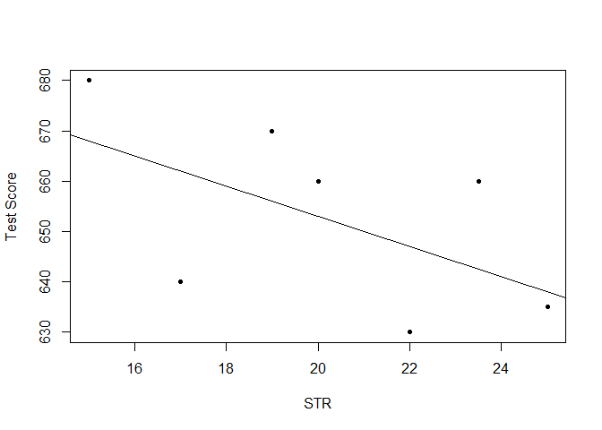
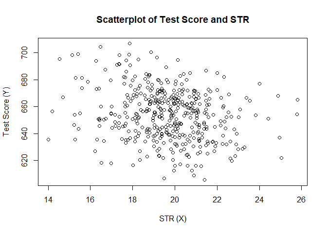
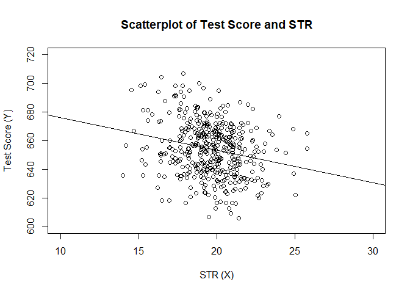
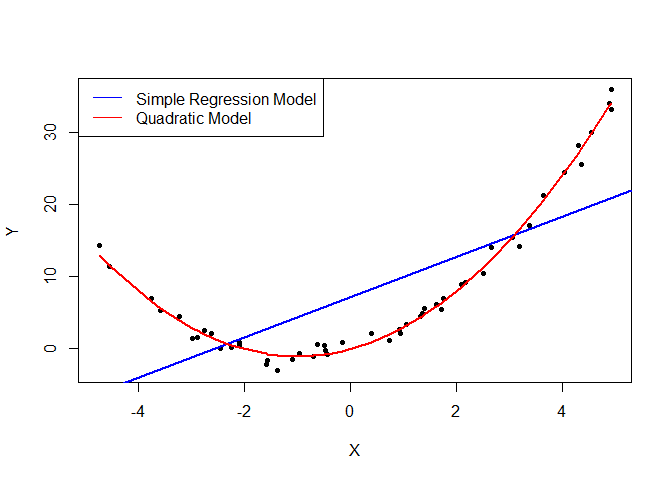
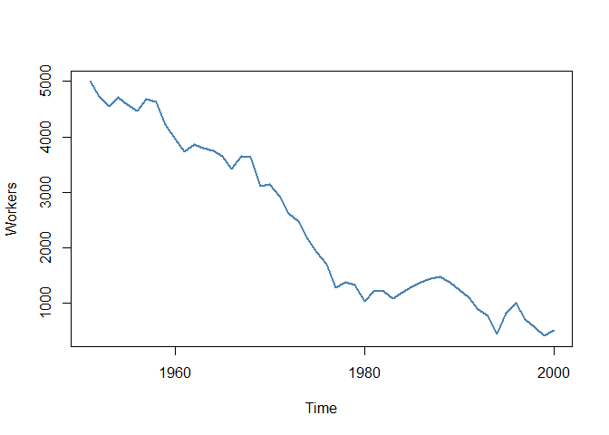

Linear Regression with One Regressor
================
2024-11-24

### Simple Linear Regression

``` r
STR <- c(15, 17, 19, 20, 22, 23.5, 25)
TestScore <- c(680, 640, 670, 660, 630, 660, 635)

# Scatterplot
plot(TestScore ~ STR, ylab = "Test Score", pch = 20)

# Add systematic relationship
abline(a = 713, b = -3)
```

<!-- -->

$$
Y_i = \beta_0 + \beta_1 X_i + u_i, \, i = 1, \dots, n
$$

### Estimating the Coefficients of the Linear Regression Model

``` r
# Load the CASchools dataset
data("CASchools", package = "AER")

# Compute STR and TestScore
CASchools$STR <- CASchools$students / CASchools$teachers
CASchools$score <- (CASchools$read + CASchools$math) / 2

# Summary statistics
avg_STR <- mean(CASchools$STR)
avg_score <- mean(CASchools$score)
sd_STR <- sd(CASchools$STR)
sd_score <- sd(CASchools$score)
quantiles <- c(0.10, 0.25, 0.4, 0.5, 0.6, 0.75, 0.9)
quant_STR <- quantile(CASchools$STR, quantiles)
quant_score <- quantile(CASchools$score, quantiles)

DistributionSummary <- data.frame(Average = c(avg_STR, avg_score),
                                  StandardDeviation = c(sd_STR, sd_score),
                                  Quantiles = rbind(quant_STR, quant_score))
DistributionSummary
```

    ##               Average StandardDeviation Quantiles.10. Quantiles.25.
    ## quant_STR    19.64043          1.891812       17.3486      18.58236
    ## quant_score 654.15655         19.053347      630.3950     640.05000
    ##             Quantiles.40. Quantiles.50. Quantiles.60. Quantiles.75.
    ## quant_STR        19.26618      19.72321       20.0783      20.87181
    ## quant_score     649.06999     654.45000      659.4000     666.66249
    ##             Quantiles.90.
    ## quant_STR        21.86741
    ## quant_score     678.85999

``` r
# Scatterplot
plot(score ~ STR, 
     data = CASchools,
     main = "Scatterplot of Test Score and STR", 
     xlab = "STR (X)",
     ylab = "Test Score (Y)")
```

<!-- -->

``` r
# Correlation
cor(CASchools$STR, CASchools$score)
```

    ## [1] -0.2263627

### The Ordinary Least Squares Estimator

``` r
# Compute beta_1_hat
beta_1 <- sum((CASchools$STR - mean(CASchools$STR)) * (CASchools$score - mean(CASchools$score))) / sum((CASchools$STR - mean(CASchools$STR))^2)

# Compute beta_0_hat
beta_0 <- mean(CASchools$score) - beta_1 * mean(CASchools$STR)

list(beta_1 = beta_1, beta_0 = beta_0)
```

    ## $beta_1
    ## [1] -2.279808
    ## 
    ## $beta_0
    ## [1] 698.9329

``` r
# Scatterplot and regression line
plot(score ~ STR, 
     data = CASchools,
     main = "Scatterplot of Test Score and STR", 
     xlab = "STR (X)",
     ylab = "Test Score (Y)",
     xlim = c(10, 30),
     ylim = c(600, 720))

abline(lm(score ~ STR, data = CASchools))
```

<!-- -->

### Measure of Fit

$$
\text{ESS} = \sum_{i=1}^n \left( \hat{Y}_i - \overline{Y} \right)^2,
$$

$$
\text{TSS} = \sum_{i=1}^n \left( Y_i - \overline{Y} \right)^2,
$$

$$
R^2 = 1 - \frac{\text{SSR}}{\text{TSS}}.
$$

``` r
model1 <- lm(grades ~ STR, data = CASchools)
```

    ## Warning in model.response(mf, "numeric"): using type = "numeric" with a factor
    ## response will be ignored

    ## Warning in Ops.factor(y, z$residuals): '-' not meaningful for factors

``` r
model1_summary <- summary(model1)
```

    ## Warning in Ops.factor(r, 2): '^' not meaningful for factors

``` r
# Compute R^2 manually
SSR <- sum(model1$residuals^2)
```

    ## Warning in Ops.factor(model1$residuals, 2): '^' not meaningful for factors

``` r
TSS <- sum((CASchools$score - mean(CASchools$score))^2)
R2 <- 1 - SSR/TSS

# Compute SER manually
n <- nrow(CASchools)
SER <- sqrt(SSR / (n-2))

list(R2 = R2, SER = SER)
```

    ## $R2
    ## [1] NA
    ## 
    ## $SER
    ## [1] NA

### The Least Squares Assumptions

#### Assumption 1: The Error Term has Conditional Mean of Zero $$E(u) = 0$$

``` r
# set a seed to make the results reproducible
set.seed(321)

# simulate the data 
X <- runif(50, min = -5, max = 5)
u <- rnorm(50, sd = 1)

# the true relation  
Y <- X^2 + 2 * X + u                

# estimate a simple regression model 
mod_simple <- lm(Y ~ X)

# estimate a quadratic regression model
mod_quadratic <- lm( Y ~ X + I(X^2))

# predict using a quadratic model 
prediction <- predict(mod_quadratic, data.frame(X = sort(X)))

# plot the results
plot( Y ~ X, col = "black", pch = 20, xlab = "X", ylab = "Y")
abline( mod_simple, col = "blue",lwd=2)
lines( sort(X), prediction, col="red", lwd=2)
legend("topleft", 
       legend = c("Simple Regression Model", 
                  "Quadratic Model"),
       cex = 1,
       lty = 1,
       col = c("blue","red"))
```

<!-- -->

#### Assumption 2: Independently and Identically Distributed Data

``` r
# set seed
set.seed(123)

# generate a date vector
Date <- seq(as.Date("1951/1/1"), as.Date("2000/1/1"), "years")

# initialize the employment vector
X <- c(5000, rep(NA, length(Date)-1))

# generate time series observations with random influences
for (t in 2:length(Date)) {
    X[t] <- -50 + 0.98 * X[t-1] + rnorm(n = 1, sd = 200)
}

# plot the results
plot(x = Date, 
     y = X, 
     type = "l", 
     col = "steelblue", 
     ylab = "Workers", 
     xlab = "Time",
     lwd=2)
```

<!-- -->
