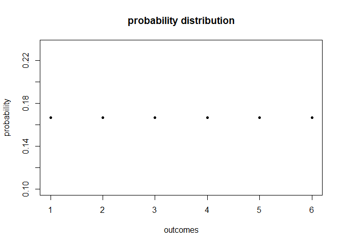
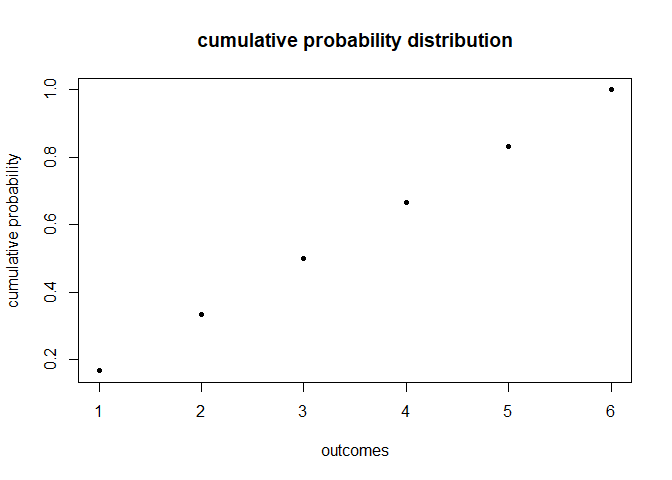
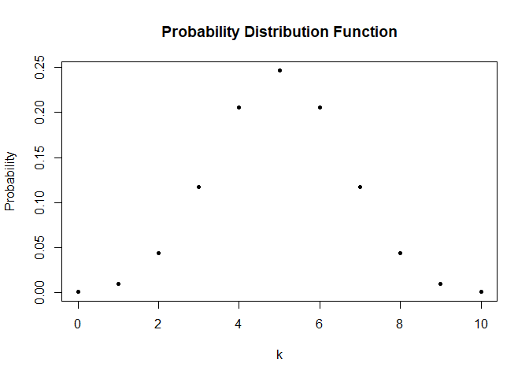
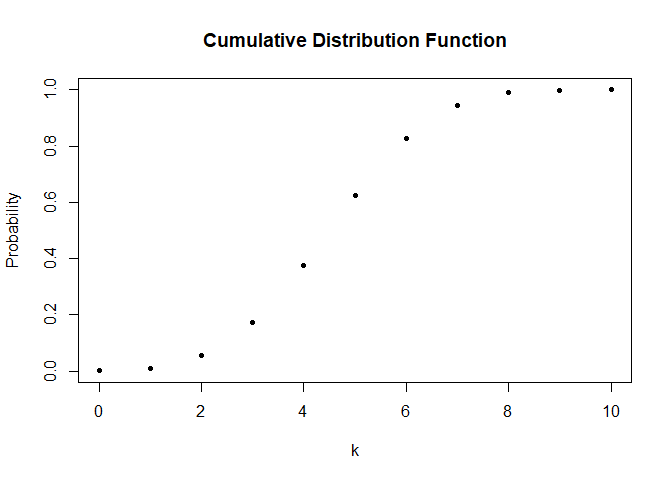
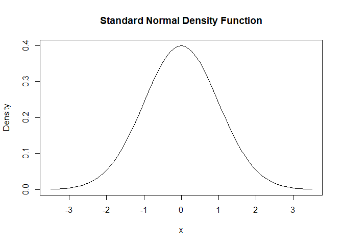
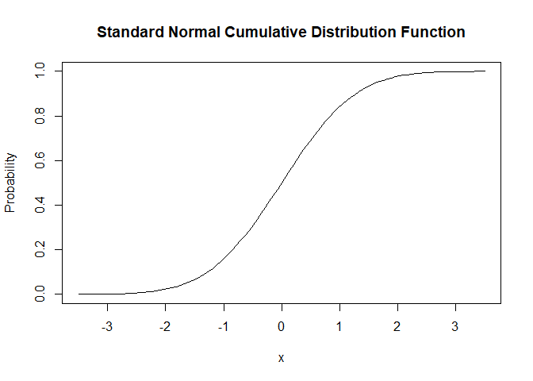

Random Variables and Probability Distribution
================
2024-11-24

### Probability Distribution of Discrete Random Variable

``` r
# generate the vector of probabilities
probability <- rep(1/6, 6) # rep() stands for replicate

# plot the probability distribution (discrete: PMF/ continuous: PDF)
plot(probability,
     xlab = 'outcomes',
     ylab = 'probability',
     main = 'probability distribution',
     pch = 20) # pch stands for plotting symbols 
```

<!-- -->

``` r
# generate the vector of cumulative probabilities 
cum_probability <- cumsum(probability) 

# plot the cumulative probability distribution
plot(cum_probability, 
     xlab = "outcomes", 
     ylab="cumulative probability",
     main = "cumulative probability distribution",
     pch=20) 
```

<!-- -->

The **probability distribution (PDF)** of a discrete random variable is
the list of all possible values of the variable and their probabilities
that sum to 1.

The **cumulative probability distribution (CDF)** function gives the
probability that the random variable is less than or equal to a
particular value.

Example: PDF - 1:1/6, … 6: 1/6  
CDF - 1:1/6, 2:2/6, 3:3/6, 4:4/6, 5:5/6, 6:6/6

``` r
sample(1:6, size = 1) # 1 random sampling given a sample space of {1,2,3,4,5,6}
```

    ## [1] 6

------------------------------------------------------------------------

### Bernoulli Trials

``` r
# vector of all possible outcomes
k <- 0:10

prob_pdf <- dbinom(x = k, size = 10, prob = 0.5)

# plot the outcomes against their probabilities
plot(x = k, 
     y = prob_pdf,
     ylab="Probability",
     main = "Probability Distribution Function",
     pch=20)
```

<!-- -->

``` r
prob_cdf <- pbinom(q = k, size = 10, prob = 0.5)
# plot the cumulative probabilities
plot(x = k, 
     y = prob_cdf,
     ylab="Probability",
     main = "Cumulative Distribution Function",
     pch=20) 
```

<!-- -->

``` r
# compute P(4 <= k <= 7) using 'pbinom()', which calculates the CDF
pbinom(size = 10, prob = 0.5, q = 7) - pbinom(size = 10, prob = 0.5, q = 3) 
```

    ## [1] 0.7734375

``` r
#> [1] 0.7734375
```

``` r
# compute P(4 <= k <= 7) using 'sum of dbinom()'
sum(dbinom(x = 4:7, size = 10, prob = 0.5))
```

    ## [1] 0.7734375

``` r
# P(k = 5| n = 10, p = 0.5)
dbinom(x = 5,  # dbinom gets the probability mass function (prob. of specific number of successes)
       size = 10,
       prob = 0.5) 
```

    ## [1] 0.2460938

``` r
# let k denote head, then we know the probability of observing head 5 times in the 10 tosses is about 24.6%
```

$$k \sim B(n,p)$$

$$f(k) = P(k) = \binom{n}{k} \cdot p^k \cdot (1-p)^{n-k} = \frac{n!}{k!(n-k)!} \cdot p^k \cdot (1-p)^{n-k}$$

``` r
# Simulation of coin tossing outcome
sample(c('H', 'T'), 1)
```

    ## [1] "H"

------------------------------------------------------------------------

### Expected Value, Mean and Variance

``` r
# set seed for reproducibility
set.seed(1)

# mean(rolling a dice three times in a row) (with replacement = True)
mean(sample(1:6, 3, replace = T))
```

    ## [1] 2

``` r
# mean(rolling a dice 1000 times in a row) (with replacement = True); should observe a result close to 3.5
mean(sample(1:6, 1000, replace = T))
```

    ## [1] 3.524

``` r
# compute mean of natural numbers from 1 to 6
mean(1:6)
```

    ## [1] 3.5

$$E(Y) = y_1p_1 + ... + y_kp_k = \sum^{k}_{i=1}y_ip_i$$  
Example:  
$$E(D) = 1 \cdot 1/6 + ... + 6 \cdot 1/6 = 3.5$$

------------------------------------------------------------------------

### Variance and Standard Deviation

Sampling variance (possible to achieve in reality):  
- Measures how the n observations in the sample are dispersed around the
sample average  
- $s^2$ is not equal to Var(Y):
$$\frac{1}{N} \sum^{N}_{i =1} (y_i - \mu_Y)^2$$

$$s_Y^2 = \frac{1}{n-1} \sum^{n}_{i =1} (y_i - \bar{y})^2$$

Population variance (impossible in reality to achieve):  
$$\sigma_y^2 = Var(Y) = E[(Y - \mu_y)^2] = \sum^{k}_{i=1}(y_i - \mu_y)^2 p_i$$

------------------------------------------------------------------------

### Probability Distribution of Continuous Random Variables

``` r
# To compute the integrals, we can define a function(x) and use integrate
f <- function(x) 3 / x^4
g <- function(x) x * f(x)
h <- function(x) x^2 * f(x)

# compute E(X)
EX <- integrate(g,
                lower = 1,
                upper = Inf)$value # $value allows us to extract the object from the list
EX
```

    ## [1] 1.5

``` r
# compute Var(X)
VarX <- integrate(h,
                  lower = 1,
                  upper = Inf)$value - EX^2 
VarX
```

    ## [1] 0.75

$$f_X(x) = \frac{3}{x^4}, x > 1$$

$$P(a \leq Y \leq b) = \int^{b}_{a} f_Y(y) dy$$  
$$E(Y) = \mu_Y = \int y f_Y(y) dy$$  
$$Var(Y) = \sigma^2_Y = \int (y-\mu_Y)^2 f_Y(y) dy$$

------------------------------------------------------------------------

### Normal Distribution

``` r
# compute the probability
1 - 2 * (pnorm(-1.96)) 
```

    ## [1] 0.9500042

$$P(-1.96 \leq Z \leq 1.96) = 1 - 2 \cdot P(Z \leq -1.96)$$

``` r
f <- function(x) {
  1 / sqrt(2 * pi) * exp(-0.5 * x^2)
}
# define a vector of reals
quants <- c(-1.96, 0, 1.96)

# compute densities
f(quants)
```

    ## [1] 0.05844094 0.39894228 0.05844094

``` r
# compare to the results produced by 'dnorm()'
f(quants) == dnorm(quants)
```

    ## [1] TRUE TRUE TRUE

``` r
# integrate f()
integrate(f, lower = -Inf, upper = 1.337)
```

    ## 0.9093887 with absolute error < 1.7e-07

``` r
pnorm(1.337)
```

    ## [1] 0.9093887

``` r
# draw a plot of the N(0,1) PDF
curve(dnorm(x),
      xlim = c(-3.5, 3.5),
      ylab = "Density", 
      main = "Standard Normal Density Function") 
```

<!-- -->

``` r
# compute density at x=-1.96, x=0, and x=1.96
dnorm(x = c(-1.96, 0, 1.96))
```

    ## [1] 0.05844094 0.39894228 0.05844094

``` r
# plot the standard normal CDF
curve(pnorm(x), 
      xlim = c(-3.5, 3.5), 
      ylab = "Probability", 
      main = "Standard Normal Cumulative Distribution Function")
```

<!-- -->

$$\phi(c) = \Phi'(c), \quad \Phi(c) = P(Z \leq c), \quad Z \sim N(0,1)$$  
$$N(\mu, \sigma^2), \text{where } \mu = 0 \text{ and } \sigma = 1$$  
$$f(x) = \frac{1}{\sqrt{2\pi \sigma}} \exp^{-(x-\mu)^2 / (2\sigma^2)}$$

``` r
f <- function(x) {
  1 / sqrt(2 * pi) * exp(-0.6 * x^2)
}
```

------------------------------------------------------------------------

### Chi-Squared Distribution

``` r
pnorm(4, mean = 5, sd = 5) - pnorm(3, mean = 5, sd = 5) # N(μ = 5, σ² = 25), P(3 <= Y <= 4)
```

    ## [1] 0.07616203

Suppose $\overline{Y}$ is normally distributed with mean $\mu$ and
variance $\sigma^2$:  
$$\overline{Y} \sim \mathcal{N}(\mu, \sigma^2)$$

------------------------------------------------------------------------

### Computing Probabilities Involving Normal Random Variables

The bivariate normal probability density function is given by:  
$$g_{X,Y}(x, y) = \frac{1}{2\pi \sigma_X \sigma_Y \sqrt{1 - \rho_{XY}^2}}
\exp \left(-\frac{1}{2(1 - \rho_{XY}^2)} \left[\left(\frac{x - \mu_X}{\sigma_X}\right)^2- 2 \rho_{XY} \left(\frac{x - \mu_X}{\sigma_X}\right) \left(\frac{y - \mu_Y}{\sigma_Y}\right) + \left(\frac{y - \mu_Y}{\sigma_Y}\right)^2\right]\right)$$

The joint density of uncorrelated ($\rho_{XY} = 0$) standard normal
variables simplifies to:  
$$
g_{X,Y}(x, y) = \frac{1}{2\pi} \cdot \exp\left\{-\frac{1}{2} \left[x^2 + y^2\right]\right\}.
$$
