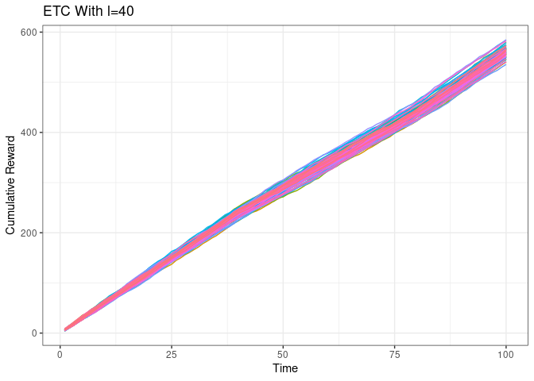
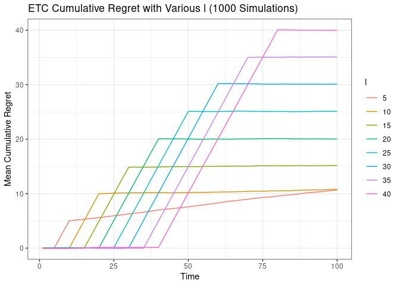
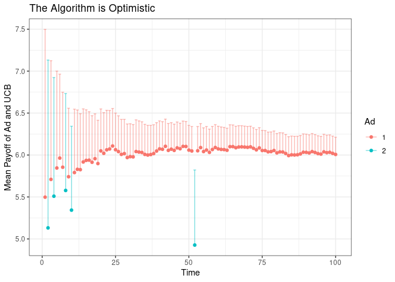
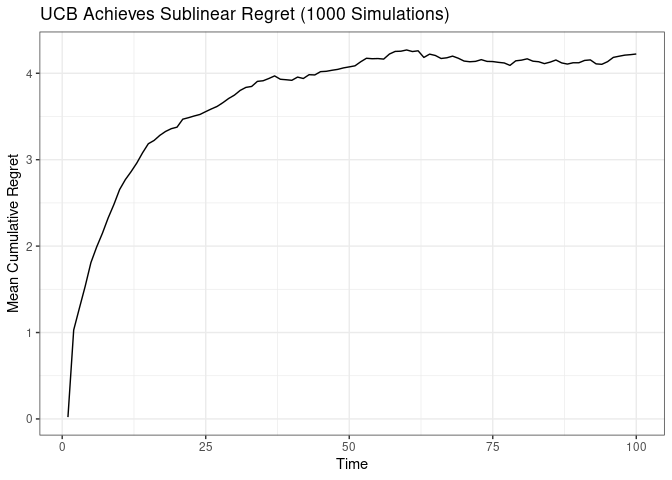

Bandit Algorithm Notes
================
2025-01-20

### Question to ask

Say, we have constraint of a budget running 100 ads, where there are two
format of ads that we want to run; we don’t know which one is better, so
we want to have a method to know

**Pre-conditions**

- we assume ad1 is better than ad2, given a small scale
  survey/questionnaire/poll, but we don;t know the actual effect
  - ad1: 6 people favors it out of unknown population, ad2: 5 favors it
    out of unkown population
- we assume iid and normal conditions in the events of ad1 and ad2

### Explore-then-Commit Algorithm (ETC)

- attempt to run the ads L amount of times
- compute the mean of each trials
- run the ads with highest mean each time

``` r
simulate_etc <- function(l){
    trials_1 <- 6 + rnorm(l)
    trials_2 <- 5 + rnorm(l)
    # compute the sample mean for each ad
    y_bar_1 <- mean(trials_1)
    y_bar_2 <- mean(trials_2)
    # commit to the better ad
    if(y_bar_1 > y_bar_2){
        return(c(trials_1, trials_2, 6 + rnorm(100-2*l))) # note 100 - 2L defines our limits of budget for ads to run after the experiment 
                                                          #(trial1 vector + trial2 vector + commit vector)
    }else{
        return(c(trials_1, trials_2, 5 + rnorm(100-2*l)))
    }
}

simulate_etc(10)
```

    ##   [1] 7.097487 5.356809 7.323304 5.366585 6.926544 6.473920 6.558881 6.649076
    ##   [9] 5.438276 6.747615 4.640713 5.480784 2.695994 6.259056 4.624699 6.867757
    ##  [17] 4.921401 4.739901 4.755519 3.462529 5.147613 7.612772 4.870227 5.370400
    ##  [25] 4.861507 6.900077 5.943114 7.535785 4.862722 6.253176 3.898158 6.261118
    ##  [33] 6.490761 6.461177 7.209372 4.378989 6.375244 7.046370 4.911218 7.287935
    ##  [41] 6.775300 8.243478 4.355287 5.408282 7.362099 6.898938 5.430386 6.053158
    ##  [49] 5.072922 5.406030 6.136782 8.719951 6.069213 6.168702 6.190891 6.510154
    ##  [57] 5.582790 6.478391 5.923863 4.349545 4.227477 5.652259 7.090725 6.260959
    ##  [65] 6.017178 5.402945 6.297962 6.186126 6.358303 5.125908 6.489434 6.261639
    ##  [73] 5.091101 7.204911 5.905889 5.064452 5.886333 5.610798 5.732038 5.627010
    ##  [81] 7.420421 7.938033 6.294634 7.498037 5.419479 4.750529 5.885067 5.030870
    ##  [89] 6.176750 6.542744 5.471864 5.462634 5.697809 5.106152 5.812826 5.884310
    ##  [97] 6.693779 6.942397 4.693189 6.859372

The visualization of ECT algorithm

``` r
library(dplyr)
```

    ## 
    ## Attaching package: 'dplyr'

    ## The following objects are masked from 'package:stats':
    ## 
    ##     filter, lag

    ## The following objects are masked from 'package:base':
    ## 
    ##     intersect, setdiff, setequal, union

``` r
library(ggplot2)

etc_sim_df <- 
  lapply(1:100, function(id_val) # function is empty called, but we have a list-apply for the 100 time for our 100 ad runs; id sourced from 1:100
  {data.frame(id = id_val,t = 1:100, # you take in 100 rows filled with data from the simulation (note: len(simulate_etc(L) = 100 ) and assign to id_i
  reward = simulate_etc(40))}) %>% 
  bind_rows() %>%               # combine the ids into single df
  group_by(id) %>%             
  mutate(cum_payoff = cumsum(reward),   
cum_regret = t * 6 - cum_payoff # measure of regret; arbitrary for now
  ) %>%
  ungroup()

print(unique(etc_sim_df$id)) # should return 1...100
```

    ##   [1]   1   2   3   4   5   6   7   8   9  10  11  12  13  14  15  16  17  18
    ##  [19]  19  20  21  22  23  24  25  26  27  28  29  30  31  32  33  34  35  36
    ##  [37]  37  38  39  40  41  42  43  44  45  46  47  48  49  50  51  52  53  54
    ##  [55]  55  56  57  58  59  60  61  62  63  64  65  66  67  68  69  70  71  72
    ##  [73]  73  74  75  76  77  78  79  80  81  82  83  84  85  86  87  88  89  90
    ##  [91]  91  92  93  94  95  96  97  98  99 100

``` r
print(nrow(etc_sim_df)) # should return 10k rows (100*100)
```

    ## [1] 10000

``` r
ggplot(data = etc_sim_df) +
  geom_line(aes(x = t, 
                y = cum_payoff, 
                group = factor(id), 
                color = factor(id))) +
  labs(x = 'Time', 
       y = 'Cumulative Reward', 
       title = 'ETC With l=40') +
  theme_bw() +
  theme(legend.position = 'none')
```

<!-- -->

### Regret in ETC Algorithm

- Acutally running a 10k trials is costly
- We can to incur regret to prevent overexploring
  - incur expected regret only on ad2, the ad where we are less
    confident with

``` r
etc_sim_df <- bind_rows(
  lapply(
    c(1:40000),
    function(id_val){
      data.frame(
        'id' = id_val,
        't' = c(1:100),
        'l' = ceiling(id_val/5000)*5, # round to the nearest integer, then multiply by 5
        'reward' = simulate_etc(ceiling(id_val/5000)*5)
      )
    }
  )
) %>%
  group_by(id) %>% 
  mutate(cum_payoff = cumsum(reward),
         cum_regret = t*6-cum_payoff) %>% 
  ungroup() %>% 
  group_by(l,t) %>% 
  summarise(mean_cum_regret = mean(cum_regret)) %>% 
  ungroup()
```

    ## `summarise()` has grouped output by 'l'. You can override using the `.groups`
    ## argument.

``` r
ggplot(data = etc_sim_df) +
  geom_line(aes(x=t,y=mean_cum_regret,group=factor(l),color=factor(l))) +
  labs(x = 'Time', y = 'Mean Cumulative Regret', 
       title = 'ETC Cumulative Regret with Various l (1000 Simulations)') + 
  guides(color=guide_legend(title="l")) +
  theme_bw()
```

<!-- -->

### Flaws in ETC and Upper Confidence Bound (UCB)

- ETC regret is calculated in linear; scaling issues; not dynamic
- Confidence interval shrink as trials run more with UCB

Play both ads for each - from 3 to 100 - denote by the number of times
that ad has been played as of time - Calculate - Play the ad with the
highest value of

``` r
simulate_ucb <- function(){
  # initialization
  n_1 <- 1
  n_2 <- 1
  rewards_1 <- 6 + rnorm(1)
  rewards_2 <- 5 + rnorm(1)
  all_rewards <- c(rewards_1, rewards_2)
  all_actions <- c(1,2)
  for(t in c(3:100)){
    # calculate the upper confidence bound
    y_bar_1 <- mean(rewards_1)
    y_bar_2 <- mean(rewards_2)
    a_1 <- y_bar_1 + 2/sqrt(n_1)
    a_2 <- y_bar_2 + 2/sqrt(n_2)
    # whichever ad has the higher UCB, run it,
    # and record the results
    if(a_1 > a_2){
      n_1 <- n_1 + 1
      reward <- 6 + rnorm(1)
      rewards_1 <- c(rewards_1, reward)
      all_rewards <- c(all_rewards, reward)
      all_actions <- c(all_actions, 1)
    }else{
      n_2 <- n_2 + 1
      reward <- 5 + rnorm(1)
      rewards_2 <- c(rewards_2, reward)
      all_rewards <- c(all_rewards, reward)
      all_actions <- c(all_actions, 2)
    }
  }
  return(data.frame(all_actions, all_rewards))
}
```

``` r
set.seed(100)
simulate_ucb() %>% 
  mutate(t = c(1:100)) %>% 
  group_by(all_actions) %>% 
  mutate(y_bar = cumsum(all_rewards)/row_number(),
         ucb = y_bar + 2/sqrt(row_number())) %>% 
  ungroup() %>% 
  ggplot(data = .) +
  geom_point(aes(x=t,y=y_bar, color = factor(all_actions))) + 
  geom_errorbar(aes(x=t,ymax=ucb,ymin=y_bar, color = factor(all_actions)), alpha = .5) +
  labs(x = 'Time', y = 'Mean Payoff of Ad and UCB', title = 'The Algorithm is Optimistic') + 
  guides(color=guide_legend(title="Ad")) +
  theme_bw()
```

<!-- -->

- we can see ad1 has a major advantage over ad2

Let’s plot the regret

``` r
ucb_sim_df <- bind_rows(
  lapply(
    c(1:1000),
    function(id_val){
      simulate_ucb() %>% 
      mutate(id = id_val,
             t = c(1:100))
    }
  )
) %>%
  group_by(id) %>% 
  mutate(cum_payoff = cumsum(all_rewards),
         cum_regret = t*6-cum_payoff) %>% 
  ungroup() %>% 
  group_by(t) %>% 
  summarise(mean_cum_regret = mean(cum_regret),
            mean_cum_reward = mean(cum_payoff)) %>% 
  ungroup()

ggplot(data = ucb_sim_df) +
  geom_line(aes(x=t, y = mean_cum_regret))+
  labs(x = 'Time', y = 'Mean Cumulative Regret', 
       title = 'UCB Achieves Sublinear Regret (1000 Simulations)') + 
  theme_bw()
```

<!-- -->

- Further investigation: Thompson Sampling
