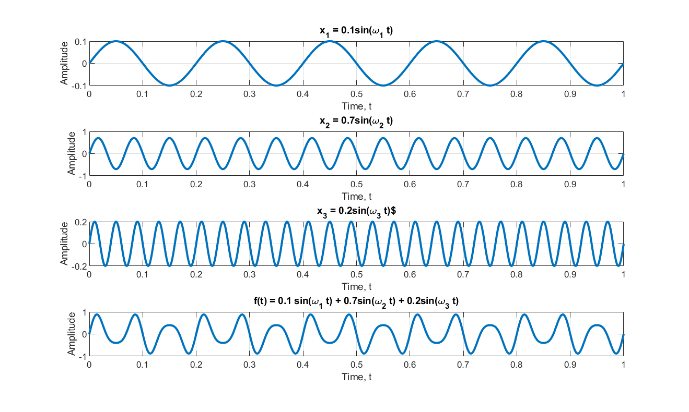

### Properties of Energy and Power Signals

An energy signal $x(t)$ has zero  power
$$P_x = \lim_{T \to \infty} \frac{1}{2T} \underbrace{\int_{-T}^{T} |x(t)|^2 dt}_{\to E_x < \infty} = 0$$

A power signal has infinite energy
$$E_x = \lim_{T\to\infty}(2T) \underbrace{\frac{1}{2T}  \int_{-T}^{T} |x(t)|^2 dt}_{\to P_x > 0}$$

### Signal Energy and Power
let i(t) the current through a resistor, then the energy dissipated in the resistor is
$$E_R = \lim_{T \to \infty }\int^{T}_{-T} i^2 (t) R dt$$

The signal energy for a (possibly complex) signal $x(t)$ is 
$$E_x  = \lim_{T \to \infty }\int^{T}_{-T} |x(t)|^2 dt$$

The average of the signal energy over time is the signal power
### Complex Signals, Complex Numbers
$z(t) = x(t) + jy(t), j = \sqrt{-1}$
- x = R{z}
- y = Im{z}
- x and y are also called the in-phase and quadrature components of z

Complex number is polar form: $z = re^{j \phi}$
- r: modulus/magnitude of z
- $\phi$: angle/phase of z
- exp($j\phi$): $cos(\phi) + jsin(\phi)$
$e^{z} = e^{x+jy} = e^{x}e^{jy} = e^{x}(cos(y)+ jsin(y))$

### Causal Signals
- Causal signals are non-zero only for $t \geq 0$ (starts at $ t= 0$, or later)
- NonCausal signals are non-zero only for $t < 0$ (starts at $ t= 0$, or later)
- Anticausal signals are non-zero only for $ t \leq 0$ (goes backward in time from $t = 0$)

### Periodic Extension
- Periodic signals can be generated by periodic extension by any segment of length one period T0 (or a multiple of the period)
- We will often take a signal that is defined only over an interval $T_0$ and use periodic extension to make a periodic signal
### Periodic Signals
Continuous time signal is periodic if and only if there exists a $T_0 > 0$ such that
$$X(t + T_0) = x(t) \forall t, T_0 \text{is the period of x(t) in time}$$

A discrete-time signal is periodic if and only if there exists an integer $N_0 > 0$ such that
$$X[n+ N_0] = x[n] \forall n, N_0 \text{is the period of x[n] in sample spacings}$$

In sum: for every period/sample, there signals are identical
- The smallest $T_0$ or $N_0$ is the fundemental period of the periodic signal

### Discrete Amplitude Signals
- Discrete amplitude signals take on only a countable set of values.
- Example: Quantized signal (binary, fixed point, floating point)
- A digital signal is a quantized discrete-time signal.
- Requires treatment as random process, not part of this course
### Even and Odd Symmetry
An even signal is symmetric about the origin
- $x(t) = x(-t)$

An odd signal is antisymmetric about the origin
- $x(t) = -x(-t)$

Any signal can be decomposed into even and odd componenets
$x_e(t) = \frac{1}{2}[x(t) + x(-t)]$
$x_o(t) = \frac{1}{2}[x(t) - x(-t)]$

Check that:
$x_e(t) = x_e(-t)$
$x_o(t) =-x_o(-t)$
$x_e(t) + x_o(t) = x(t)$
The decomposition into even and odd components depends on the
location of the origin. Shifting the signal changes the decomposition

### Combinations of Operations
Scaling, shifting, and reveralsa combined operation can be perforemd in
any order, but care is required
ex. $x(2(t-1))$
- compress by 2, advance by 1 < - > advanced by 1, compress by 2
    - $x(2(t-1))$: shift first (mag: 1), then compres (mag: 2)
    - $x(2t-2)$: shift first (mag: 2), then compres (mag: 2); this is incorrect
        - note: distributive property does not apply in signal operation

Tryout examples

### Time shift
For continuos-time signal x(t) and a time $t_1 > 0$
- advance: $x(\tau = t) \rightarrow \tau = t - t_1, x(t - t_1)$
- delay: $x(\tau = t) \rightarrow \tau = t + t_1, x(t + t_1)$

note: gaussian peak should be located at tau = 0

For a discrete time signal x[n], and an integer $n_1$ > 0
- advance: $x[\tau = n] \rightarrow \tau = n - n_1, x[n - n_1]$
- delay: $x[\tau = n] \rightarrow \tau = n + n_1, x[n + n_1]$

note: discrete gaussian peak should be located at tau = 0
### Time Reversal
x(-t) vs. x(t), x[-n] vs. x[n]
### Time Scaling, Discrete Tie
x[nk] - compress
- extracts every kth sample of x[n]
- intermediate  samples are lost
- the sequence is shorter

x[n/m] - expends
- specifies every mth sample
- the intermediate samples must be synthesized (set to zero, or interpolated)
- the sequence is longer


### Time Scaling, Continous Time
x(bt)
- Compress: b > 1
- Expands: 0 < b < 1
```matlab

```
### Amplitude Scaling
ax(t)

ax[n]

### Signal Characteristis and Models
- Operations on the time dependence of a signal
    - Time scaling
    - Time reversal
    - Time shift
    - Combinations
- Signal characteristics
- Periodic signals
- Complex signals
- Signals sizes
- Signal Energy and Power
### Summary
- A signal is a collection of data
- Systems act on signals (inputs and outputs)
- Mathematically, they are similar. A signal can be represented by a function. A system can be represented by a function (the domain is the space of input signals)
- Course emphasis: 1d signal, non-random systems
### Discrete Time Signals
- samples: x[n], where n is an integer over some (possibly infinite) interval
- x[n] = x(nT), where n is an integer and T is the sampling period

### Continuous Time Signals
- Funttion of a time variable: t, $\tau$, $t_1$
- Signal is denoted as v, v(.), or v(t), where t is a dummy varaible
<insert png>
### Types of Systems
Continuous-time system has continuous-time inputs and outputs.
- AM or FM radio
- Conventional (all mechanical) car

Discrete-time system has discrete-time inputs and outputs.
- PC computer game
- Matlab
- Your mortgage

Hybrid systems are also very important (A/D, D/A converters).
- You playing a game on a PC
- Modern cars with ECU (electronic control units)
- Most commercial and military aircraft


### Continous and Discrete Time Signals
CT: signal has values for all points in time in some (possibly infinite) interval (f(t))

DT:  signal has values for only discrete points in time (f[n])

Signals can also be a function of space (images) or of space and time (video), and may be continuous or discrete in each dimensio
### Systems
A system take a signal and convert it into another signal
- Internally, a system may contain many different types of signals.
- The systems perspective allows you to consider all of these together
### Signals
Any physical or abstract quantity that can be measured and convery information can be thought of as a signal

### Course Overview
Idea 3: Frequency Domain Lets You Control Lineary Systems
ex. To control a car's speed; applying more gas causes the car to speed up
<insert a png>
- error prone; freq domain analysis should explain why and tell the designer to do with the system

Idea 2: Linear Systems are easy to Analyze for Sinusoids
- To model a curb encounter, a step function input, a differnetial euqation approach could be hard to solve
    - But transforming the input into freq. domain input and obtain the trasnfer function (easy to solve, a scaler), we can get the freq domain output and mapped to time domain output by inverse transform
note: LTI should only be analyzed by freq. domain

Idea 1: Frequency Domain Representation of Signals
- Represent signal as a combination of sinusoids



note: $\omega_2$ contribued the most of the sinusoid

Why use frequenecy domand representation?
- Simpler for many types of signal (e.g. AM radio signal)
- Many systems are easier to analyze from this perspecive (Linear System)
- Reveals the fundemental characterics of a system

Demo: Paino Chord 
The plot of amplitude vs frequency is much easier to understand a waveform of stucked chords